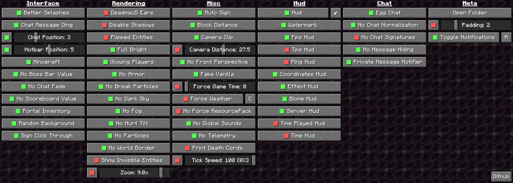
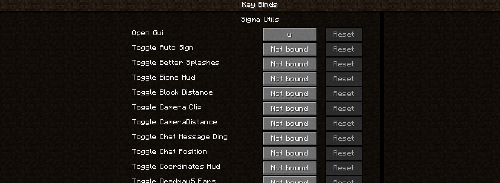
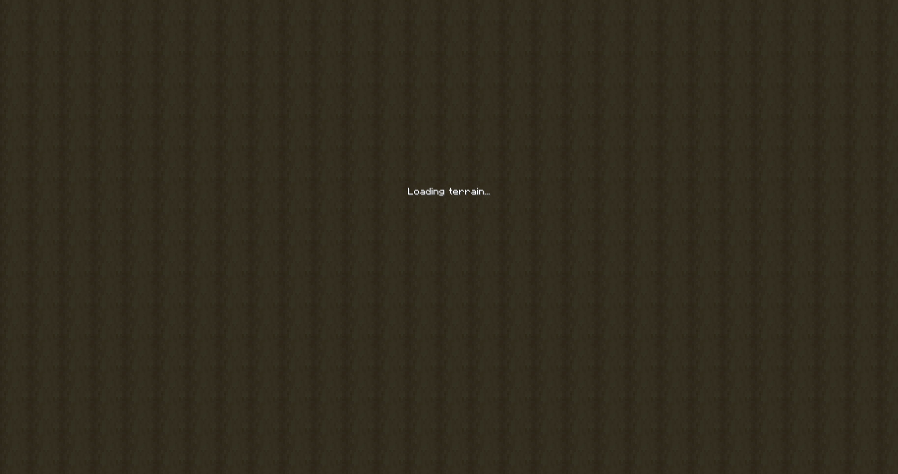
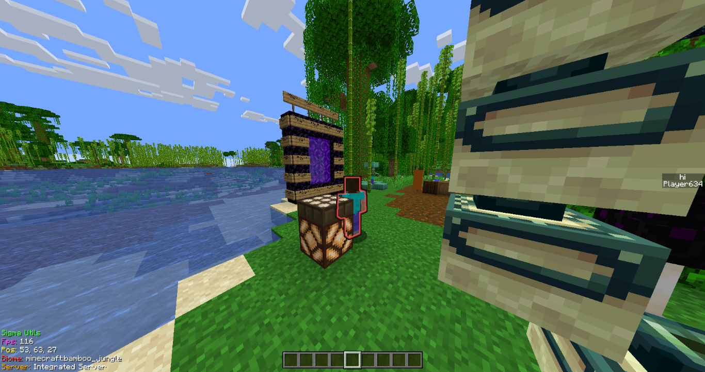
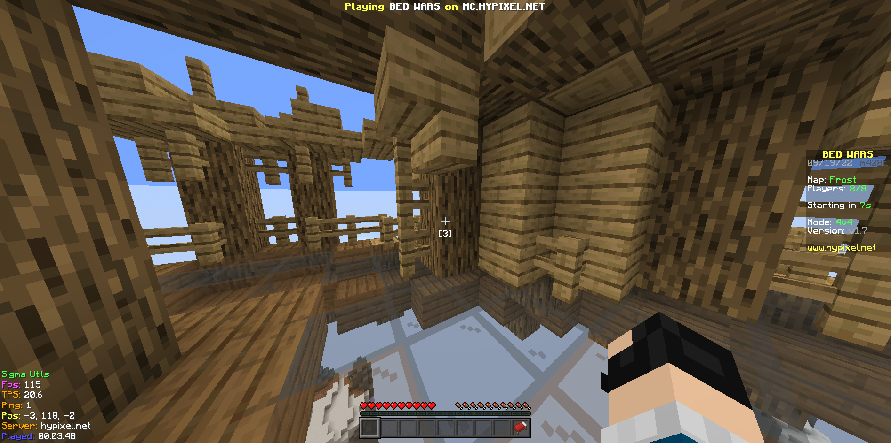

@Title = A new Utility Mod
@Author = Connor Slade
@Date = 09-25-22
@Description = My process of making a shiny new Minecraft utility mod
@Tags = Minecraft, Mod, Modding, Fabric, Utility
@Path = minecraft/a-new-utility-mod
@Assets = .

---

# A new Utility Mod

After making my [Universal Tick](/writing/minecraft/universal-tick) mod I wanted to make a new mod, but I wasn't really sure what I wanted it to do.
I was thinking about having it disable the built-in telemetry or add a custom HUD.
But instead of making lots of little mods, I ultamatly decided to make a Utility mod with lots of little tweaks.

<div ad info>
Info

Final source code is available [here](https://github.com/Basicprogrammer10/SigmaUtils) on GitHub!

_don't forget to give it a star_

</div>

## Interface

Before I can make any of the modules I need a way to toggle them and change settings.
Lots of utility mods have fancy GUIs, but for this one I just wanted something simple.

What I eventually got was a screen with different categories (Interface, Rendering, Misc, Hud and Meta).
And rows of module buttons for each one.



I also wanted to have module toggle hotkeys so, when the mod is starting it registers a key bind for every module.



## The Modules

The mod currently has ~55 modules so I'm just going to focus on some of them in this article.

### Random Background

The first module I added is `Random Background`.
This module changes the normal tessellated dirt background into one with a different block every time.

When the mod starts it loads a list of valid background blocks.
These are blocks with static textures and no transparency.
It then uses a Mixin on the `renderBackgroundTexture` method in the `Screen` class.

If the module is enabled it gets the hash of the current screen and if it is different from the one stored, it picks a new background texture.
If the module is disabled it sets the texture to the default dirt.

```java
int screenHash = -1;
int assetIndex = -1;

@Redirect(method = "renderBackgroundTexture", at = @At(value = "INVOKE", target = "Lcom/mojang/blaze3d/systems/RenderSystem;setShaderTexture(ILnet/minecraft/util/Identifier;)V"))
private void setShaderTexture(int texture, Identifier id) throws Exception {
    if (Config.getEnabled("random_background")) {
        int currentScreenHash = Objects.requireNonNull(MinecraftClient.getInstance().currentScreen)
                .hashCode();

        if (screenHash != currentScreenHash || assetIndex < 0) {
            screenHash = currentScreenHash;
            assetIndex = new Random().nextInt(RandomBackground.validBackgrounds.size());
        }
        RenderSystem.setShaderTexture(0, Identifier.tryParse("textures/block/" + RandomBackground.validBackgrounds.get(assetIndex) + ".png"));
        return;
    }

    RenderSystem.setShaderTexture(0, OPTIONS_BACKGROUND_TEXTURE);
}
```

This ends up looking really cool:



<script>
const background = document.querySelector('[background]');
const images = ['loading-0.png', 'loading-1.png', 'loading-2.png']
let index = 0;

setInterval(() => {
    index = (index + 1) % 3;
    background.src = `../assets/minecraft/a-new-utility-mod/${images[index]}`;
}, 1000);
</script>

### Glowing Players

This was the simplest and most usefull module I made, It lets you see players through blocks even if they are invisible.
It does this by making all players render glowing if the module is on.

If the module is on it just sets the return value of `hasOutline` to be true if the entity is a player.

```java
@Inject(method = "hasOutline", at = @At("RETURN"), cancellable = true)
void onHasOutline(Entity entity, CallbackInfoReturnable<Boolean> cir) throws Exception {
    if (Config.getEnabled("glowing_players") && entity instanceof PlayerEntity) cir.setReturnValue(true);
}
```



### No Boss bar Value

This is one of my original ideas that I haven't seen done before.
When playing on mini-game servers, they often use boss bars to display some text at the top of the screen.
Because the value of the boss bar isn't showing anything it just takes up extra space.

This module disables the value bar from rendering while still rendering the text.
It injects into the `renderBossBar` method on the `BossBarHud` class and cancels it.
This stops the boss bar value from being rendered.
It then redirects the text rendering in order to change the y value, as it needs to be shifted up to account for the now gone value bar.

```java
@Inject(method = "renderBossBar(Lnet/minecraft/client/util/math/MatrixStack;IILnet/minecraft/entity/boss/BossBar;)V", at = @At("HEAD"), cancellable = true)
void onRenderBossBar(MatrixStack matrices, int x, int y, BossBar bossBar, CallbackInfo ci) throws Exception {
    if (Config.getEnabled("no_boss_bar_value")) ci.cancel();
}

@Redirect(method = "render", at = @At(value = "INVOKE", target = "Lnet/minecraft/client/font/TextRenderer;drawWithShadow(Lnet/minecraft/client/util/math/MatrixStack;Lnet/minecraft/text/Text;FFI)I"))
int onDrawWithShadow(TextRenderer instance, MatrixStack matrices, Text text, float x, float y, int color) throws Exception {
    if (Config.getEnabled("no_boss_bar_value")) y = 9 * (y / 19) + 2;
    return instance.drawWithShadow(matrices, text, x, y, color);
}
```



### No Telemetry

In Minecraft version `1.3.1` Mojang first added telemetry, but it was possible to disable it.
But due to [GDPR](https://gdpr-info.eu/) it was removed in version `1.13`.
However, in version `1.18` it was re added quietly with no way to disable it without modding the client

So this module just disables that telemetry.
Because in development versions of the game no telemetry is sent, this is actually really easy.

With a mixin redirecting the call to `isDevelopment` in the `TelemetrySender` constructor, you can just return true and no telemetry will be sent.

```java
@Redirect(method = "<init>", at = @At(value = "FIELD", target = "Lnet/minecraft/SharedConstants;isDevelopment:Z"))
boolean isDevelopment() throws Exception {
    if (Config.getEnabled("no_telemetry")) return true;
    return SharedConstants.isDevelopment;
}
```

### Egg Chat

Now on to the most complicated module of all,,, **_EGG CHAT_**.
This sophisticated module modifies your chat messages to have 100% more egg puns.

Using a handcrafted mixin on the `ChatScreen` the chat message normalization function is modified to not only normalize the message but to also call `EggChat.eggify`.

```java
@Redirect(method = "sendMessage", at = @At(value = "INVOKE", target = "Lnet/minecraft/client/gui/screen/ChatScreen;normalize(Ljava/lang/String;)Ljava/lang/String;"))
String onChatMessageNormalize(ChatScreen instance, String chatText) throws Exception {
    if (!chatText.isEmpty()) MinecraftClient.getInstance().inGameHud.getChatHud()
            .addToMessageHistory(chatText);

    String text = instance.normalize(chatText);
    if (Config.getEnabled("egg_chat") && !text.startsWith("/")) text = EggChat.eggify(text);
    return text;
}

// * SNIP * //

public static String eggify(String inp) {
  return Arrays.stream(inp.split(" "))
    .map(w -> {
      if (w.contains("ex") && !w.endsWith("ex")) return w.replace("ex", "egg");
      return w;
    })
  .collect(Collectors.joining(" "));
}
```

With this module enabled, boring chat messages like "That's excellent" become more eggtastic ("eggcellent").
No further explanation is needed.

## Module Systems

Now that you have seen some of the simple mixins making up a few of the modules, we can look into the other systems making up the mod.

### Module Class

There is an abstract `Module` class that defines the structure all the modules are built on.
It contains the following bits of data:

```java
// A Module id (EX: egg_chat)
public final String id;
// The modules frendly name (EX: Egg Chat)
public final String name;
// A discription of the module (EX: Modifies your outgoing chat messages to use maximum egg puns)
public final String description;
// A catagory (EX: Category.Chat)
public final Category category;
// And weather the module is enabled
public boolean enabled;
```

Although all the modules are built on this, they often don't need much control and only need the ability to be en/disabled.
That is where the `BasicModule` comes in!
It's a class extending Module and it makes defining simple modules very easy.
Here is the module definition for the Egg chat module.
The BasicModule class takes care of config loading so its very simple.

```java
public class EggChat extends BasicModule {
    public EggChat() {
        super("egg_chat", "Egg Chat", "Modifies your outgoing chat messages to use maximum egg puns", Category.Chat);
    }
}
```

### Config System

Being able to enable and disable modules at runtime is great but having to do it every time you start your game is annoying.
So SigmaUtils has a config system!
It uses an NBT file and module gets its own components to store whatever it wants.
Most modules simply have an `enabled` property, but others like `AutoSign` store the 4 lines of text to put on the signs.

When the mod starts, after all the modules have been loaded it reads the config file.
For each loaded module it then tries to find its matching config entry and runs the module's own `loadConfig` method.
This lets the module do whatever it wants with the config but it is usually just storing the enabled property.

The final part of the config system is saving of course!
On config save it makes a new `NbtCompound` and adds the results of each module's `saveConfig` method.
The final result is then saved to your game directory.

### Async Runner

The next section is on the client commands added to the game.
Some of these commands take a long time to run, and would block the main thread freezing the game.
So thats what the Asycn runner is, a system for running and manageing tasks in other threads.

The runner runs classes implamenting the `Task` interface:

```java
public interface Task {
    // A friendly name for the task
    String getName();
    // A function to check if the task is running
    boolean running();
    // Starts task execution on a diffrent thread
    void start(UUID uuid);
    // Trys to stop the task - the task can ignore this
    void stop();
}
```

## Commands

Some functions of the client are invoked through commands.
The commands are not just normal commands, but they are subcommands to the `/util` command.
This is to keep all the SigmaUtill commands together and to reduce the possibility of one of the client commands interfering with a server one.
They all implement the `Command` interface which has one method: `register`.
The register method is used to pass a `CommandDispatcher<FabricClientCommandSource>` to all the commands for registration.
The next subsections will go over a few of the commands.

### Chat

One interesting commands I made is the `chat` command.
It does what you expect: sends text as a chat message.
Although it is very simple, I found an interesting property of it.

Minecraft has different ways of sending commands and chat messages to the server, so using this commands you could do something like: `/util chat "/gamemode creative"`.
This would actually send the commands in chat and it won't be run (on vanilla servers).

### Map

This command lets you get info and save maps.
The info sub, sub command gives you the map's ID, scale, and locked status.
Nothing super interesting.

The save command however lets you save the image on a map to your screenshots folder.
This could be useful for saving map arts.

The commonality between these two commands is that they need a map to work with.
To get the map it first checks if you are holding a filled map item.
If you are that's the chosen map, but if not it checks if you are looking at an item frame.
If you are then the map in the item frame is chosen.

### Run

This is the most advanced command, it allows for repeating / delaying commands as well as formatting commands.
Repeating and delaying are kinda really simple, it just runs a commands n times or waits n milliseconds before running it.

Formatting commands in SigmaUtils means that if you run for example `/util run formatted "Hello %PLAYERNAME%"` it will send a chat message saying hello to all online players.
But you can do so much more, by using multiple formatters it will go through all the permutations.
So running with the format `"%PLAYERNAME% says hi to %PLAYERNAME%"`, it will have every online player say hi to every online player.

But wait!
There's even more, formatters can use modifiers too.
These can even be chained to make formatters like this: `%PLAYERNAME:isonline:randomcase%`, which will make sure the player is online and if so randomly change the case of letters in the name.

## Conclusion

This will definitely be a project that I come back to every so often.
There are so many things I want to add at some point.

Feel free to download the most recent prebuilt version [here](https://nightly.link/Basicprogrammer10/SigmaUtils/workflows/build/master/Artifacts.zip).
