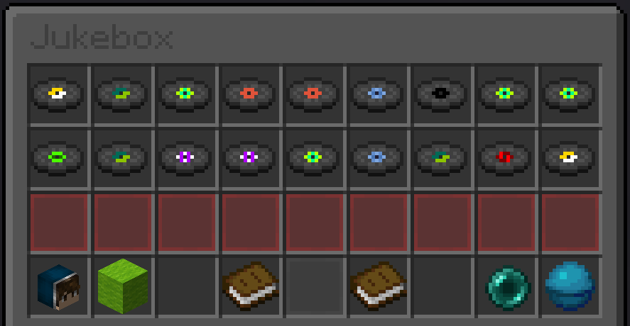

@Title = Jukebox Plugin
@Author = Connor Slade
@Date = 07-11-22
@Description = Playing midi through Minecraft
@Tags = Minecraft
@Path = minecraft/jukebox-plugin
@Assets = .

---

# 🎻 Jukebox Plugin

Have you ever wanted to play midi remakes of your favorite songs through Minecraft?
Well I certainly haven't but I'm going to do it anyway.

I made a bukkit plugin to read [Note block Studio](https://opennbs.org/) files and use a nice in game UI to let players pick songs to be played.
It then sends packets to all the players to have their clients play note block sounds.

<div ad info>
Info

Source code can be found [here](https://github.com/Basicprogrammer10/cornroot) on Github.
If you want to set it up and use it there are builds for MC `1.16.5` under releases and instructions in the README.

This was made as a plugin commission _(feel free to [dm me](/contact) :P)_ so to play music you need credits, you can gain these with the `/globalkeyadd <UUID> [count]` command.
(Op bypasses the need for keys)

</div>

## 👓️ The UI

So I need an easy way to select songs, toggle settings and view the song queue, and I think an Inventory UI is the best option.

This is the final design that I used, the first two rows are random music discs renamed with the song name (they also have the artist and song length in the lore).
There is a separator layer of red glass pains.
Then a user stats item showing how many songs you have player, a mute button, books for going to the previous and next page, an enderpearl for viewing the queue and a heart of the sea to see system info.



## 📼 Loading the songs

There is a nice document explaining the .nbs file format [here](https://opennbs.org/nbs).
Basically it's made up of 4 sections, but only 2 really matter here: Header and Noteblocks.
The header had stuff like the song name, song author, tempo, length, etc.
And the noteblock section holds each noteblock and info about it (instrument, key).

Now one may think that reading such a simple file format would be easy,,, but those people don't know java.
This turned out to be the most difficult part of this whole project, and it's all because of the `BufferedInputStream`.

I thought this class would make it easy to read the 2-byte shorts and the 4-byte ints from the file data easily, but it just wouldn't work.
It would read the number but then wouldn't increment the byte index or something.
I still have no idea why, it just wouldn't work.
I spent hours working with it and eventually decided to just do it my self.

I first got a byte array from each song file with `Files.readAllBytes`, then went on to parsing it.
I made functions to read the different data types like shorts, ints and strings.
But because java, I couldn't pass a mutable reference to the byte index, so I had to make a new class: `MutInt`.
It's just a wrapper around an int that you can call `.increment(int)` on.

So here is how it parses the file header:

```java
// Read file to byte array
byte[] bytes = Files.readAllBytes(file.toPath());
MutInt i = new MutInt(0);

// Version check
assert readShort(i, bytes) == 0;

// Get song length
i.increment(4);
this.length = readShort(i, bytes);

// Get song name
i.increment(2);
this.name = readString(i, bytes);
this.author = readString(i, bytes);

// Get tempo
skipStrings(i, bytes, 2);
this.tempo = readShort(i, bytes) / 100f;

i.increment(23);
skipStrings(i, bytes, 1);
i.increment(4);
```

Then on to the noteblock parsing.
This was actually easier than I thought it would be.

```java
ArrayList<Note> notes = new ArrayList<>();
int value = -1;
while (true) {
    short noteJumpTicks = readShort(i, bytes);
    value += noteJumpTicks;
    if (noteJumpTicks == 0) break;

    while (true) {
        short layerJumpTicks = readShort(i, bytes);
        if (layerJumpTicks == 0) break;

        Instrument instrument = readInstrument(i, bytes).orElse(Instrument.Piano);
        byte key = readByte(i, bytes);
        i.increment(2);
        short pitch = readShort(i, bytes, true);

        notes.add(new Note(value, instrument, key, pitch));
    }
}
```

### 🌀 Converting songs

This parser only supports the new nbs format so `>3`.
Because of this I made a little python script to convert older nbs files to the newest format.
It uses the `pynbs` library and tries to get a song and author name from the file name: `AUTHOR-NAME.nbs`.

```python
import pynbs
import os

for filename in os.listdir("."):
    if filename.endswith(".nbs"):
        file = pynbs.read(filename)
        parts = filename.split(".")[0].split(" - ")
        if len(parts) != 2:
            print(filename + " is not in the correct format")
            tmp = parts[0]
            parts = ["Unknown", tmp]

        file.header.song_author = parts[0].strip()
        file.header.song_name = parts[1].strip()
        file.save('./upgraded/' + filename.strip())
        print("[UPGRADED] " + parts[1].strip() + " - " +
              parts[0].strip())
```

## 🎶 Playing music

So now that we have all the songs loaded in memory, how do we play one?
This is kinda jank and very much unsafe but here we go.

When a song is played it loops through all of its notes and because of the way it was loaded, it just waits `lastTick - thisTick`.
Because this is in ticks and Thread.sleep uses milliseconds it can be converted like this: `(thisTick - lastTick) / (tempo / 1000)`
Here is the code:

```java
Bukkit.getScheduler()
    .runTaskAsynchronously(Cornroot.getPlugin(Cornroot.class), () -> {
        int lastTick = 0;
        for (Song.Note i : this.notes) {
            try {
                if (i.tick - lastTick != 0)
                    Thread.sleep((long) ((float) (i.tick - lastTick) / (this.tempo / 1000)));
                lastTick = i.tick;
            } catch (InterruptedException ex) {
                ex.printStackTrace();
            }
            for (Player p : getServer().getOnlinePlayers())
                p.playSound(p.getEyeLocation(), i.getSound(), Config.baseVolume, i.getPitch());
        }
    });
```

Once a song finishes, if there is another one in the queue it waits a bit then starts to play that one.

## 😸 Conclusion

It might not be the most usefull thing, but it is kinda cool.
You could use it to rick roll your Minecraft server or just sync music between your friends.
Enjoy this example video:

<video src="../assets/minecraft/jukebox-plugin/video.mp4" controls></video>

<div ad note>
Note

This sounds weird because of the limitations with converting midi into note block sequences.
The delay from the server to the client also doesn't help.

</div>
