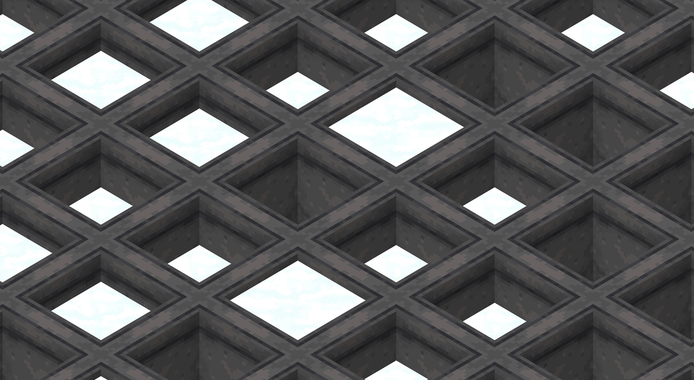

@Title = Powder Snow Farm
@Author = Connor Slade
@Date = 03-03-22
@Description = My process of creating a large scale powder snow farm
@Tags = Minecraft, Farm, Powder Snow, Powder Snow Farm
@Path = minecraft/powder-snow-farm
@Assets = .

---

# 🌨 Powder Snow Farm

The design process I took in creating my Large scale Minecraft [Powder Snow][powder_snow] farm.
This farm was designed for the [404 Technical Minecraft Server][404_tmc].

## 📐 Planning

Yay! It's everyone's favorite part of the design process, planning!
First, I need to get a general concept for the farm.
For this, I looked at the powder snow farm used in [ilmangos][ilmango] Peaceful Series ([Video][farm-concept-video]).
It used a 6 by 6 chunk (96 blocks) array of cauldrons where the player is moved through them, collecting the powder snow with buckets.
Hopper minecarts then collect the powder snow bucket items created and move them to a storage system.
There is also a system to send new buckets to the player to be able to collect more than just 16 powder snow :p

<!-- </img> -->
So why go with this size of farm?
Here on the right is an ugly diagram I spent way too long making that shows the chunk the player is currently in with blue, Green for the approximate area that will be random ticked and red the size of the farm I picked.
Going any bigger would cause the farm to need more than one player to have the whole thing being ticked at all times.

Unfortunately, there is no world download or schematic for this Peaceful Series farm, leaving me to design my own based off of the video.

## 🍬 Design

</img>
I started by creating the base hopper minecart platform. This is just a 9x9 chunk area of white concrete.
I then used world edit to add in all the powered rails for this layer.
Then I made a new layer of white concrete the same size one layer up from the rails, this is where the player minecrat would go.
Every 18 blocks, I put in a row of redstone blocks to power the rails.
The player minecart system used normal rails as well as powered rails, and as it turns out world edit does not work too well with cloning rails, lol.

I then put in all `9,312` cauldrons, completing the easy part of the farm :). Now it was onto the bucket refiller system.

</img>

This system used droppers to store the rail lane the player is in and used a trap door to stop the buckets at that point.
When the player goes by the needed buckets are picked up, and slice is activated, causing the extras buckets to be sent back to storage and the next lane activated.
You can see the two wide tillable segment here on the right.

I then started work on the control panel / storage thing. The storage system loads the powder snow into skulkers and puts the skulkers into an array of 75 double chests.
Nothing crazy here, just a bunch of hoppers. The control panel is a little cooler, it's the system that sends the buckets to the player.

</img>

It uses 8 droppers, they each fire twice to drop 16 buckets to refill the stack.
This dispensing system is controlled by a hopper clock (with `35` items).
The hopper clock can then be controlled with a toggle switch. It is also turned off if any of the following 'errors' are detected.
Storage Full, Out of skulker, and Out of buckets.

[powder_snow]: https://minecraft.fandom.com/wiki/Powder_Snow
[404_tmc]: https://discord.gg/eBJbuNcGkH
[ilmango]: https://www.youtube.com/channel/UCHSI8erNrN6hs3sUK6oONLA
[farm-concept-video]: https://www.youtube.com/watch?v=42t72abCJPE
