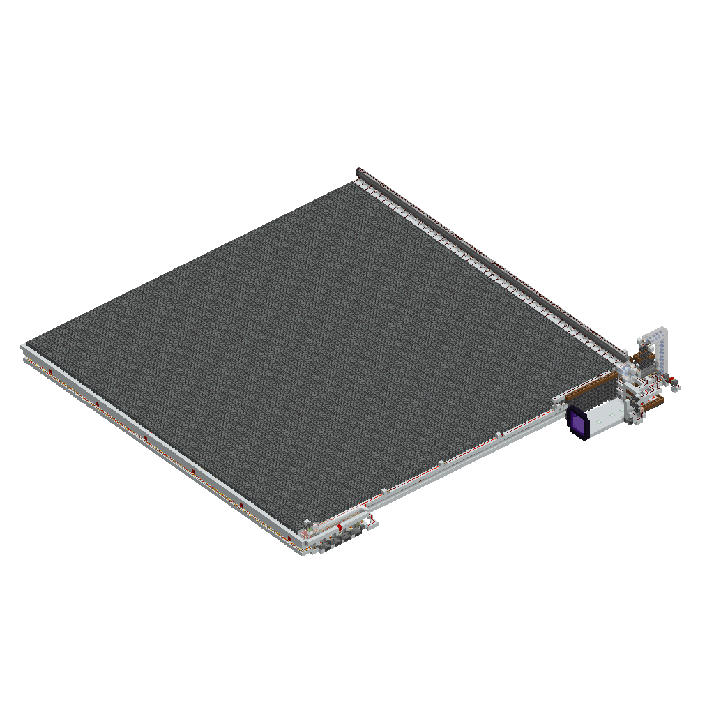

@Title = Powder Snow Farm
@Author = Connor Slade
@Date = 03-06-22
@Description = My process of creating a large scale powder snow farm
@Tags = Minecraft, Farm, Powder Snow, Powder Snow Farm
@Path = minecraft/powder-snow-farm
@Assets = .

---

# 🌨 Powder Snow Farm

The design process I took in creating my Large scale Minecraft [Powder Snow][powder_snow] farm.
This farm was designed for the [404 Technical Minecraft Server][404_tmc].

  Note

This farm was designed for [Minecraft 1.17.1][mc_1_17_1]

## 📐 Planning

Yay! It's everyone's favorite part of the design process, planning!
First, I need to get a general concept for the farm.
For this, I looked at the powder snow farm used in [ilmangos][ilmango] Peaceful Series ([Video][farm-concept-video]).
It used a 6 by 6 chunk (96 blocks) array of cauldrons where the player is moved through them, collecting the powder snow with buckets.  
Hopper minecarts then collect the powder snow bucket items created and move them to a storage system.
There is also a system to send new buckets to the player to be able to collect more than just 16 powder snow :p
Unfortunately, there is no world download or schematic for this Peaceful Series farm, leaving me to design my own based off of the video.

So why go with this size of farm? Because the [Random Tick distance][random_tick_wiki] is the chunks within 128 blocks of the player.
This means that 6 chunks is the largest it can be, with one player ticking the whole farm from anywhere in the farm.

## 🍬 Design

</img>
I started by creating the base hopper minecart platform.
This is just a 9x9 chunk area of white concrete.
I then used world edit to add in all the powered rails for this layer.
Then I made a new layer of white concrete the same size one layer up from the rails, this is where the player minecrat would go.
Every 18 blocks, I put in a row of redstone blocks to power the rails.
The player minecart system used normal rails as well as powered rails, and as it turns out world edit does not work too well with cloning rails, lol (see picture on the left).
Fortunately the fill command worked fine allowing me to set the rail direction.
I then put in all `9,312` cauldrons, completing the easy part of the farm :). Now it was onto the bucket refiller system.

</img>
This system uses a dropper line to remember the rail lane the player minecart is at and used a trap door to stop the buckets at that point.
When the player goes by, the needed buckets are picked up, and slice is activated, causing the extras buckets to be sent back to storage and the next lane activated.
At the very end, the item is sent back to the beginning and the whole thing starts again.
You can see the two wide tillable segment here on the right.
I then started work on the control panel / storage thing. The storage system loads the powder snow into skulkers and puts the skulkers into an array of 75 double chests.
Nothing crazy here, just a bunch of hoppers.

</img>

The control panel is a little cooler, it's the system that sends the buckets to the player.
It uses 8 droppers, each firing twice to drop 16 buckets to refill the stack.
This dispensing system is controlled by a hopper clock (with `35` items).
The hopper clock can then be controlled with a toggle switch. It is also turned off if any of the following 'errors' are detected,
storage full, out of skulkers, or out of buckets.
If the farm is turned off by either the player or by an error, all the hopper mine carts and the player in a minecarts are held in a

## 🛸 Building

Needing 12k gold, over 18k concrete blocks, and over 67k iron not including the buckets, this farm requires a lot of materials.
Luckily, we already had most, there was just a lot of crafting involved.
I spent a night just crafting resources for this, then built it the next day by clearing an area in a snowy biome and level by level built it up.

Unfortunately, I didn't do enough testing and found some problems after running the farm for a while.
The first one was that hopper minecarts and player minecart would desync after some time.
This turned out to be caused by the rail path for the hopper minecart being a bit shorter than the other one.

The second major issue I found was with the minecart parking system.
This system was indented to hold the minecart when the system was stopped so when it is restarted the minecart are all properly synced.
This was solved by a full redesign of the parking systems.

(These problems are all fixed in the schematic)

  Info

The schematic for this farm can be found [here][schematic]

## 🚙 Render

Move your mouse across this image to get a 3D view of the farm.
Pretty cool, huh? This took way too long to make, lol.

</img>

## 🥨 Conclusion

This is my first Minecraft related article,,, so that's cool.
The same farm concept can be used for a lava farm as well (new article idea??).
A lava farm would be a lot smaller because it is generated much faster.
Figuring out the best size required plotting geometric distributions and other calculus stuff, so keep an eye out for that article.

[powder_snow]: https://minecraft.fandom.com/wiki/Powder_Snow
[404_tmc]: https://discord.gg/eBJbuNcGkH
[mc_1_17_1]: https://minecraft.fandom.com/wiki/Java_Edition_1.17.1
[ilmango]: https://www.youtube.com/channel/UCHSI8erNrN6hs3sUK6oONLA
[farm-concept-video]: https://www.youtube.com/watch?v=42t72abCJPE
[random_tick_wiki]: https://minecraft.fandom.com/wiki/Tick#Chunk_tick
[schematic]: https://connorcode.com/files/Schematics/Powder_Snow_Farm.litematic
