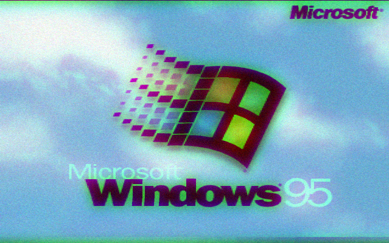

@Title = ILOVEYOU Virus
@Author = Connor Slade
@Date = 02-07-22
@Description = About the early 2000s computer virus ILOVEYOU
@Tags = ILOVEYOU, Virus
@Path = other/i-love-you-virus
@Assets = .

---

# 😍 ILOVEYOU Virus

> For a school project :p

## About

The ILOVEYOU virus was a computer virus that caused widespread damage in May 2000.
It was created by Onel de Guzman who was a college student in Manila.
He was unable to pay for internet access and made the program to steal other users' internet passwords.
But he never thought it could grow to be as big as it did.
The program was written in Visual Basic and was spread by email as an attachment with the subject line "I LOVE YOU".

## The Vulnerability

The Windowstm operating system, in an attempt to keep things simple for the user hides the file extension.
This causes the `.TXT.vbs` file to appear as just a `.TXT` file, often misleading the user into opening the file.
Unsurprisingly, this is still the default behavior on Windows to this day. (_oh microsoft_)

## Effects

When opened, the attachment sent a copy of the virus to all the user's contacts.
The virus goes through the drives connected to the machine and replaces many of the files with copies of itself.
The only exception is `mp3` audio files, for whatever reason It just hides them.

## Containment

The ILOVEYOU virus was eventually contained and eradicated, but not before causing considerable damage.
Estimates of the damage caused by the virus range from $5 billion to $10 billion, and it caused around \$15 billion to remove.
It is estimated that around 10% of computers that were connected to the internet were affected.
The Pentagon, CIA, British parliament, and many large corporations shut their email systems down to protect against the virus.

## Conclusion

The ILOVEYOU virus was a wake-up call for the world's computer users, highlighting the need for better security measures.
It also showed the potential damage that can be caused by computer viruses.
