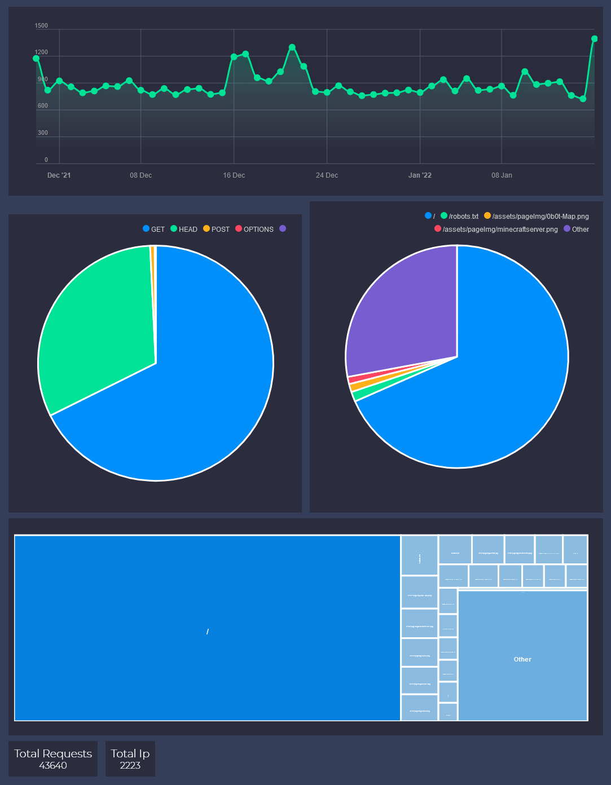

@Title = How my Analytics Work
@Author = Connor Slade
@Date = 01-17-21
@Description = How my custom analytics system for connorcode.com works
@Tags = Analytics, Web Dev, Server, afire
@Path = other/my-analytics
@Assets = .

---

# 📜 How my analytics work

I want to be able to see if anybody is interested in my website, but I also care about online privacy.
So Google Analytics or anything like it was out as it doesn't respect user privacy.
So I decided to write my own analytics system!

## 📚 Requirements

The first step was to figure out what I wanted it to do. This is what I came up with.

It will log every request's time, method, user agent and referrer, Each
request will be grouped by the client IP address, and it will save the
data in a binary format to save space. An API route will also be made to remotely retrieve the data (with authentication of course).

## 📀 Implementation

> Note: You can see the full implementation on GitHub
> [here](https://github.com/Basicprogrammer10/connorcode/blob/master/src/analytics.rs)

This whole system runs as _pre_ Middleware for [afire](https://crates.io/crates/afire),
So every request it will add the request starts to an internal buffer.
About every hour it will load the analytics file for that day, deserialize
it, merge in the data from the buffer, re serialize it and save it.

## 📈 Analytics

I made an experimental analytics viewer for this data. It's not even close to being done yet :P.
It's made to use the Analytics API to get the data and [ApexCharts](https://apexcharts.com/) for showing it.

At the top it shows total requests per day, under it shows the 5 most common HTTP methods as well as the 5 most common paths, and below that is a Tree Graph of the 25 most common paths.
It is a bit redundant on the paths, but again It's still _experimental_.
The very bottom has some simple global stats.

