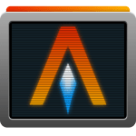

@Title = My Stack
@Author = Connor Slade
@Date = 01-14-21
@Description = Tools I use to create Websites / Software
@Tags = Stack, Tools, Tech
@Path = other/stack
@Assets = .

---

# 📜 My Stack

Tools I use for creating Websites and other Programs.

## Tools

#### Atom <i class="fa fa-code"></i>

</img>

[Atom](https://atom.io/) is the text editor _for the 21st Century_.
I use it for almost all of my text editing needs. I use the following community packages as well

- [ide-rust](https://atom.io/packages/ide-rust)
- [atom-beautify](https://atom.io/packages/atom-beautify)
- [linter-eslist](https://atom.io/packages/atom-beautify)
- [logo-file-icons](https://atom.io/packages/logo-file-icons)
- [minimap](https://atom.io/packages/minimap)
- [prettier-atom](https://atom.io/packages/prettier-atom)
- [pigments](https://atom.io/packages/pigments)

#### Insomnia <i class="fa fa-code"></i>

</img>

[Insomnia](https://insomnia.rest/) is an amazing HTTP client for testing APIs.
It has support for REST, SOAP, GraphQL, and GRPC.

It has been a crucial part of development for this website and [afire](https://crates.io/crates/afire) my dependency free rust web server framework.

#### Alacritty <i class="fa fa-code"></i>

</img>

[Alacritty](https://github.com/alacritty/alacritty) is a fast, hardware accelerated terminal emulator.
It's written in rust, so it may get some bonus points :P

#### Firefox <i class="fa fa-code"></i>

</img>

[Firefox](https://www.mozilla.org/en-US/firefox/) is my prefered browser for multiple reasons.
This includes being open source, having great developer tools, and a great extension support.
Here are the main extensions I use:

- [uBlock Origin](https://addons.mozilla.org/en-US/firefox/addon/ublock-origin/)
- [Terms of Service; Didn’t Read](https://addons.mozilla.org/en-US/firefox/addon/terms-of-service-didnt-read/)
- [SponsorBlock](https://addons.mozilla.org/en-US/firefox/addon/sponsorblock/)
- [Return Youtube Dislike](https://addons.mozilla.org/en-US/firefox/addon/return-youtube-dislikes/)
- [User-Agent Switcher and Manager](https://addons.mozilla.org/en-US/firefox/addon/user-agent-string-switcher/)
- [Material Icons for Github](https://addons.mozilla.org/en-US/firefox/addon/material-icons-for-github/)
- [Decentraleyes](https://addons.mozilla.org/en-US/firefox/addon/decentraleyes/)
- [Bitwarden](https://addons.mozilla.org/en-US/firefox/addon/bitwarden-password-manager/)
- [Tampermonkey](https://addons.mozilla.org/en-US/firefox/addon/tampermonkey/)
- [uMatrix](https://addons.mozilla.org/en-US/firefox/addon/umatrix/)
- [Tree Tabs](https://addons.mozilla.org/en-US/firefox/addon/tree-tabs/)

---

## Stack
