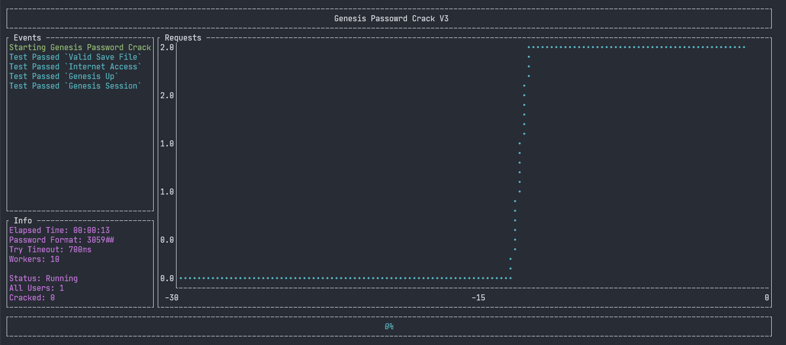

@Title = School Password Crack Returns
@Author = Connor Slade
@Date = 08-10-22
@Description = How I hacked my school, again
@Tags = School, Passwords, Hacking, Genesis
@Path = other/school-password-crack-returns
@Assets = .

---

# 🏫 School Password Crack Returns

Note

This builds off of the information in one of my previous articles [School Password Concern](school-password-concern).
Reading that first is recommended.

## Information

Sometime last year Genesis made some changes to their system that broke my old cracking system.
They added a weird feature that removes the "Incorrect Password / Account Inactive" error message if the login attempt is handled too soon after a previous one for the same account.
This was likely an attempt to keep people from cracking student passwords, and it kinda did work but, it's not exactly a good solution.

## Fix

Although this change does stop someone from quickly cracking one account at a time you could achieve the same crackings speeds as before by trying to crack different accounts while waiting.

This system functions in a very different way to all of my previous ones.
It starts with an app wide list of 'Tasks' or users to crack, each task has various values including the last crack attempt timestamp.
Then an amount of 'Workers' are started that each look for a task that is uncracked and has a last crack attempt that was at least 700ms ago.

## Implementation

It all starts with the `Password` iterator.
It takes in a formatting string like `30####` and will make it step through all possibilities like `300000`, `300001`, and so on.
Each task has its own password instance that's stepped through.

The workers all look through the task list to find a task that's not currently being cracked and has a last crack timestamp that's at least 700ms in the past.
It then sets it as cracking, so no other workers can pick it up and runs its `try_crack` method.

The task then sends a GET request to `parents.genesisedu.com/SCHOOL_PAGE/sis/view` to get a session cookie.
It then POSTS to `parents.genesisedu.com/SCHOOL_PAGE/sis/j_security_check` with the task's username and a password attempt.
Then to determine is the password is correct it checks if the response contains 'Logout' or 'Account is inactive', it is does that means the tried password is correct.
If it contains 'Username or password is incorrect' that means the password is wrong and if it contains neither, the password attempt failed.

## User Interface

Now that we have the password cracking working again.
I want to give it a text user interface when it's running that will have information about the cracking progress.

Above is a screenshot of the UI while cracking a single password.
It has an event log that shows when passwords are cracked or if any errors occur.
There is an info section that tells you the settings it's being run with as well as the status of the cracking process.
And finally the requests per second graph.

## Conclusion

I hope Genesis fixes this properly at some point.
It really isn't that hard - I don't know why they don't want to.

Anyway source code is [here](source-link).
Have a nice day!

[school-password-concern]: /writing/other/school-password-concern
[source-link]: https://github.com/Basicprogrammer10/SchoolPasswordCrack/tree/master/mass_crack
