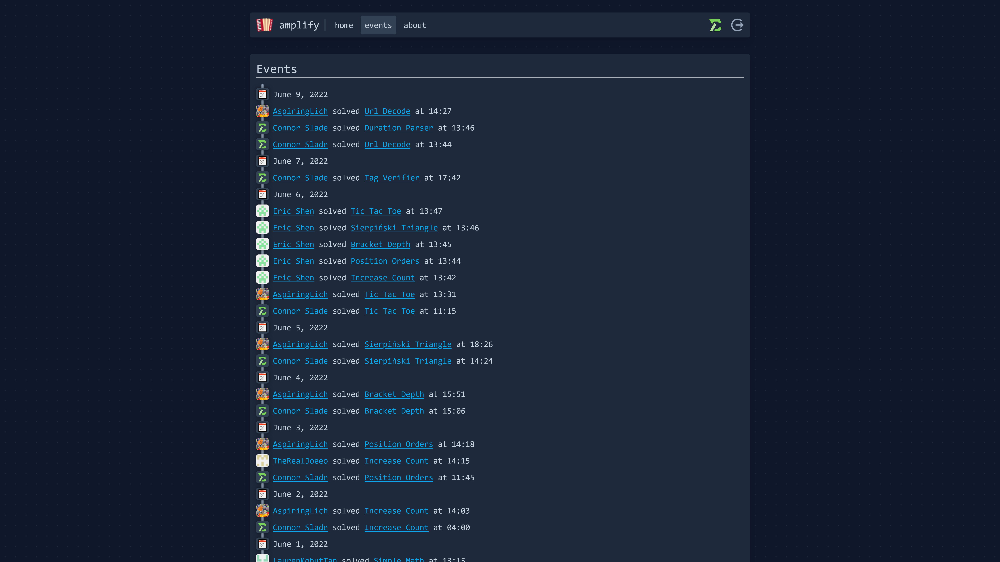

@Title = amplify
@Author = Connor Slade
@Date = 06-04-22
@Description = The creation and function of amplify
@Tags = amplify, docker, web app
@Path = programming/amplify
@Assets = .

---

# 🪗 amplify

so what is this 'amplify' thing?
well im very glad you asked,,,

amplify is kinda like advent of code but for the 17 days in June before school ends for me.
Every day a new challenge opens and you have to write some code to solve it.
The concept is simple, the execution - welllll ill get into it.

<div ad info>

You can try it out here: [amplify.connorcode.com](https://amplify.connorcode.com)

</div>

## 💡 The Idea

On May 13th I got the idea to mix [code.golf](https://code.golf) with [Advent of Code](https://adventofcode.com/) where you would get a new problem every day.
But instead of returning a signal number as your solution to the website you would write your code in it.
It will also generate the test cases based off of user IDs for added unnecessary complexity.

## 🌱 The Plan

### Authentication

So up to this point any of my web apps that needed user accounts just used basic username-password authentication, but for this one I wanted to use GitHub OAuth.
Once you log in you would see a page showing all the problems you have completed and are available to compete.
Opening a problem beings you to a page with the story / prompt for the problem, a text editor and stderr + stdout displays.

### Code Execution

Clicking run would send the code to the backend server which would use a docker container to safely compile and execute your code.
There would also be a timeout to keep infinite loops from halting the whole system.
It would then compare your output to the expected output for the problem with your seed.

### Misc

At this point I didn't really have any idea about the UI.
But I had started making a list of problem ideas:

```
 1. Simple Math
 2. Increase Count
 3. Interprate Words (up down ect) to a xy pos
 4. Max bracket {} depth
 5. Sierpiński triangle
 6. Tic Tak Toe Win Checker
 7. Html Tag Valadator
 8. URL Decode
 9. Duration Parser
10. Nth prime number
11. Readable Duration
12. Rule 30
13. Base 64 decode
14. BrainF Runner
15. Conways Game of life to n steps
16. Order Of Ops [less simple math]
17. Scale of 1-10 how good is rust
```

## 📀 The Implementation

For this application I used the following stack:

- afire - Web server framework
- apline.js - Lite frontend framework
- tailwind - Styling
- sqlite3 - Database

### Authentication

In the beginning I was having a lot of trouble understanding how OAuth auth is meant to work.
I eventually started to understand and made the following API routes: Redirect, Complete and Logout.

To login, you just request the `/auth/redirect` path which is defined like below.
It returns a redirect to the GitHub OAuth path with the client ID and generated state.
[Code here](https://github.com/Basicprogrammer10/amplify/blob/master/src/auth/redirect.rs).

Github then sends you to `/auth/complete` once it's done.
This route starts by getting the code and state from the GitHub response.
It then verifies the state and gets the user access token from github which is then used to get some basic user info like name, id and avatar.
This data is then saved to the database in the users table.
[Code here](https://github.com/Basicprogrammer10/amplify/blob/master/src/auth/complete.rs).

And finally logging out just deleted your session from the database and removes your session cookie.
[Code here](https://github.com/Basicprogrammer10/amplify/blob/master/src/auth/logout.rs).

### Code Execution

I initially spent a lot of time thinking about how to handle this.
After a lot of reading I came up with three possible solutions:

- [Godbolt API](https://godbolt.org/)
- [nsjail](https://github.com/google/nsjail)
- [Docker](https://docs.docker.com/)

I decided not to go with the Godbolt API because I wanted to try to implement safe user code execution myself.
Plus there are a lot more things that can go wrong when your application relies on other APIs.

The next to go was nsjain because as stated in its README `NsJail is a process isolation tool for Linux`.
This may be the best option if I just want to run it on Linux, but I also do some development on Windows and dealing with that is kinda annoying.

So that leaves docker.
In the [`amplify/langs`](https://github.com/Basicprogrammer10/amplify/tree/master/langs) directory I have a `languages.json` file and a folder for each language.
The JSON file defines some config for each language including its name, folder path, docker image name, and more.
The language folders each contain a `Dockerfile`, run script and any other files needed for that language.

Each Dockerfile looks very similar, as an example here is the one for rust.
It uses an image with these tools for that language installed, sets some permissions and copies some files.

```sh
FROM rust:latest

RUN useradd -m runner -d /runner
RUN usermod -p '!!' root

USER runner
WORKDIR /runner

ADD --chown=runner Cargo.toml .
ADD --chown=runner run.sh .

ENTRYPOINT ["bash", "./run.sh"]
```

Let's next look at the run.sh file.
This whole thing is a bit of a hack but hey I had tight deadlines.
We use the URL encoding to transfer the program's test cases through environment variables into the container.
The program is then built and run with the timeout command to end execution after (by default) 10 seconds.

```sh
function urldecode() { : "${*//+/ }"; echo -e "${_//%/\\x}"; }
timeout --signal=KILL ${TIMEOUT} /usr/local/cargo/bin/cargo run -- $(urldecode "${ARGS}")
```

The real magic is how the containers are run.
This code segment is from [`amplify/api/solve.rs`](https://github.com/Basicprogrammer10/amplify/blob/master/src).
This first uses the user's seed to generate the test cases.
It then writes the user's code to a temporary file.
Then it starts a docker container with a lot of options to limit the permissions of the container, to mount the temporary file as the source code file and to send over the URL encoded run arguments.
After all that the program's output is compared with the expected output and a response is sent to the client.

```rust
// Gen test cases
let args = problem.gen(seed);

// Write code to a temp file
let mut code_file = tempfile::NamedTempFile::new_in(&app.cfg.tmp_folder).unwrap();
code_file.write_all(code.as_bytes()).unwrap();

// Build and run in a docker container
let time = Instant::now();
let run = Command::new(&app.cfg.docker_command)
    .args([
        "run",
        "--rm",
        "--cap-drop=ALL",
        "--security-opt=no-new-privileges",
        "--net",
        "none",
        "--memory",
        "128m",
        "--memory-swap",
        "256m",
        "--pids-limit",
        "512",
        "-v",
        &format!(
            "{}:/runner/{}",
            code_file.path().to_string_lossy(),
            language.1
        ),
        "-e",
        &format!("TIMEOUT={}", &app.cfg.docker_timeout),
        "-e",
        &format!("ARGS={}", urlencoding::encode(&args)),
        &language.0,
    ])
    .stdout(Stdio::piped())
    .stderr(Stdio::piped())
    .spawn()
    .unwrap()
    .wait_with_output()
    .unwrap();
let time = time.elapsed().as_millis() as u64;
```

### Problems

This turned out to the hardest part of the project.
You've already seen the problem ideas so lest start with how a problem is defined.
It's done with a trait!

```rust
pub trait Problem {
    // Problem ID
    fn id(&self) -> u64;

    // Problem actavation time
    fn time(&self) -> u64;

    // Problem name
    fn name(&self) -> &'static str;

    // Get problem text
    fn text(&self) -> &'static str;

    // Gen the run args
    fn gen(&self, seed: u64) -> String;

    // Check the program output
    fn check(&self, seed: u64) -> String;
}
```

The simple math problem is one of the shortest so I will use it for this example.
Here is are some short explanations of the functions of the functions in this trait.

|  Name | Function                                                |
| ----: | :------------------------------------------------------ |
|    id | The ordering of problems on the application home page   |
|  time | (In epoch time) Time when the problem becomes available |
|  name | Name of the problem                                     |
|  text | The story and explanation of the problem (in html)      |
|   gen | Generate the test cases to give to your program         |
| check | Generate the correct solutions to the test cases        |

```rust
pub struct SimpleMath;

impl Problem for SimpleMath {
    fn id(&self) -> u64 { 0 }
    fn time(&self) -> u64 { 1654056000 }
    fn name(&self) -> &'static str { "Simple Math" }
    fn text(&self) -> &'static str { include_str!("text/build/simple_math") }

    fn gen(&self, seed: u64) -> String {
        let mut rng = ChaCha8Rng::seed_from_u64(seed);
        let mut maths = Vec::new();

        for _ in 0..10 {
            maths.push(format!(
                "{}{}{}",
                rng.gen_range::<i32, RangeInclusive<i32>>(100..=999),
                ['+', '-', '*'][rng.gen_range::<u8, Range<u8>>(0..3) as usize],
                rng.gen_range::<i32, RangeInclusive<i32>>(100..=999)
            ));
        }

        maths.join(" ")
    }

    fn check(&self, seed: u64) -> String {
        let mut rng = ChaCha8Rng::seed_from_u64(seed);
        let mut real = Vec::new();

        for _ in 0..10 {
            let p1 = rng.gen_range::<i32, RangeInclusive<i32>>(100..=999);
            let p2 = rng.gen_range::<i32, RangeInclusive<i32>>(100..=999);

            real.push(
                match rng.gen_range::<u8, Range<u8>>(0..3) {
                    0 => p1 + p2,
                    1 => p1 - p2,
                    2 => p1 * p2,
                    _ => unreachable!(),
                }
                .to_string(),
            )
        }

        real.join("\n")
    }
}
```

As you may have noticed the problem text is loaded from `text/build/...` as HTML.
In the beginning I was just writing this HTML myself but it got annoying and I decided to use Markdown.
So in the text directory is all the markdown files and a script to build them into HTML files to be loaded.

### The UI

For the UI I wanted to finally try out [Tailwind CSS](https://tailwindcss.com/).
I'm not a designer so I just kinda played around with it, and really I'm not even sure how to explain this, so I'll just show the finished product:

> Home page
>
> 

> Problem page
>
> 

> Events page
>
> 

> User Page
>
> 

### Database

For this project I used [SQLite](https://www.sqlite.org/index.html) for the database because this is a relatively simple application that I assume will be under low load.
Also, because I don't know any other database.
amplify uses 4 table (sessions, users, problems, solutions).

<details>
<summary>Table SQL</summary>

```sql
-- Sessions Table
CREATE TABLE IF NOT EXISTS sessions (
   created INTEGER NOT NULL,
   user_id TEXT NOT NULL,
   session_id TEXT NOT NULL
)

-- Users table
CREATE TABLE IF NOT EXISTS users (
   id TEXT NOT NULL,
   name TEXT NOT NULL,
   login TEXT NOT NULL,
   avatar_url TEXT NOT NULL,
   token TEXT,
   created INTEGER NOT NULL,
   new INTEGER NOT NULL,
   UNIQUE(id)
)

-- Problems table
CREATE TABLE IF NOT EXISTS problems (
    user_id TEXT NOT NULL,
    problem_id INTEGER NOT NULL,
    start_time INTEGER NOT NULL,
    end_time INTEGER,
    tries INTEGER NOT NULL,
    state INTEGER NOT NULL,
    UNIQUE(user_id, problem_id)
)

-- Solutions table
CREATE TABLE IF NOT EXISTS solutions (
    user_id TEXT NOT NULL,
    problem_id INTEGER NOT NULL,
    state INTEGER NOT NULL,
    code TEXT NOT NULL,
    language TEXT NOT NULL,
    created INTEGER NOT NULL,
    UNIQUE(user_id, problem_id, language)
)
```

</details>

## 🐍 Hosting

Even though amplify runs all the code in Docker containers, it's still possible that someone could find a way to cause problems.
Because of this I'm hosting it on its own VPS through [Vultr](https://www.vultr.com/?ref=8859764).
It's running on a High performance VPS so compile times are as fast as possible.
The web server is behind a Nginx reverse proxy that adds TLS support.
Nothing crazy.

## 📝 Conclusion

All in all this was very rushed.
If I do something like this next year I may build on this so there is less work to get it working, leaving more time for making the problems bettor.
Feel free to try it out at [amplify.connorcode.com](https://amplify.connorcode.com).

\- darren
