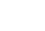

@Title = Best Worst Compression
@Author = Connor Slade
@Date = 02-15-22
@Description = Making the best (worst) compression system
@Tags = Compression, Hash, sha256, Rust, Programming
@Path = programming/best-worst-compression
@Assets = .

---

# 📁 Best Worst Compression

So,,, I think I may have just made the ~best~ _worst_ compression system ever.
I've had this idea for a while and finally decided to make this mess a reality.
It compresses any file size to around `40 bytes`, the catch is the decompression time.
For my 4 byte test file, `Hi\r\n` it took like thirty minutes to decompress.

## 🦄 How it works

So, let's see how this very _ingenious_ system works!

### Compression

For compression of a file, we take the hash of the file and the number of bytes in it.
This data is then written to a new file. Yeah, that's all.
At the very least, it's fast.
I think you can see where this is going...

Here is the code I made for compression:

```rust
fn compress<T>(file: T)
where
    T: AsRef<Path>,
{
    let inp = fs::read(&file).unwrap();
    let size = inp.len();

    let mut hasher = Sha256::new();
    hasher.update(inp);
    let hash = hasher.finalize().to_vec();

    let mut out = hash;
    out.extend((size as u32).to_be_bytes());

    let mut path = file.as_ref().to_string_lossy().to_string();
    path.push_str(".cc");

    fs::write(path, out).unwrap();
}
```

### Decompression

Here is where things get a little complicated.
We need to try every possible permutation of bytes in the defined size, then check the hash.
See what I mean, this is genius.

> </img>
>
> The equasion for permutations

For decompressing, `n` is `256` for each bit value and `k` is the file length.
If I put in my `Hi\r\n` example from before, it would take at most `4,195,023,360` checks to decompress the file.
For fun, let's see how many checks it would be at most for the text `'Hello World\r\n'`.
So that's `13` bytes, putting that through the equation gives `14,879,476,555,971,175,569,951,129,600,000`.
This would probably take many lifetimes running on the world's best computers to decompress.

And here is the code for decompression:

```rust
fn decompress<T>(file: T)
where
    T: AsRef<Path>,
{
    let inp = fs::read(&file).unwrap();

    let parts = inp.split_at(32);
    let mut rdr = Cursor::new(parts.1);
    let size = rdr.read_u32::<BigEndian>().unwrap();

    let hash = parts
        .0
        .iter()
        .map(|b| format!("{:02x}", b))
        .collect::<Vec<String>>()
        .join("");

    println!("Length: {}", size);
    println!("Hash: {}", hash);
    let hash = hash.bytes().collect_vec();

    for i in (0..=255).permutations(size as usize) {
        let mut hasher = Sha256::new();
        hasher.update(&i);
        let this_hash = hasher.finalize().to_vec();

        if this_hash == hash {
            println!("Found!");
            fs::write("OUT.txt", i).unwrap();
            break;
        }
    }
}
```

## 💁‍♂️ Conclusion

In conclusion, this was a dumb project.
I didn't really learn anything and unless I'm willing to wait millions of years to decompress a file (_im not_), it's not useful.

I guess I should put the source code somewhere if someone is even more insane than me.

> Here it is [Github Gist](https://gist.github.com/Basicprogrammer10/5377d7f5aca4efebdb390b47ca24f972)
