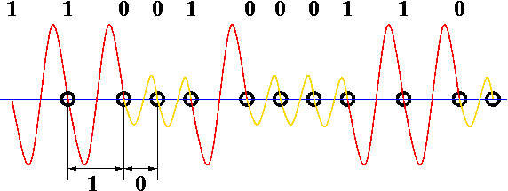
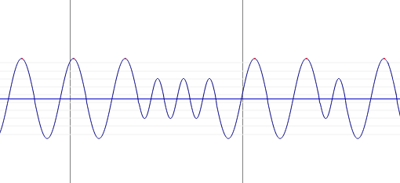

@Title = Encoding Data with Sound
@Author = Connor Slade
@Date = 07-28-22
@Description = Using audio to store binary data
@Tags = Audio, Rust, Programming
@Path = programming/encoding-data-with-sound
@Assets = .

---

# Encoding Data with Sound

Back in the 1970s and 80s before floppy discs were affordable, cassette tapes were the primary storage medium used by home computer owners.
The tapes had a waveform that could be decoded back into binary data.

In this project I wanted to make my own system to de/encode data into sound waves.

## Encoding Method

On the [Commodore Dataset](https://en.wikipedia.org/wiki/Commodore_Datasette) the voltage crossing from positive to negative is measured and the time between two of these crossings represents a 1 or 0 bit.
A longer time may represent a 1 while a shorter time may represent a 0.
This is the encoding method I decided to use.
Here is a photo from Wikipedia showing the process:



## Implementation

To make the sound files I used the [`hound`](https://github.com/ruuda/hound) crate for reading / writing wav files.
I also used the [`bitvec`](https://github.com/bitvecto-rs/bitvec) library to cleanly access the bits inside the bytes.

### Encoding

For making the waveform I made an iterator that takes in some bytes and when next is called will output the next value needed to make the waveform.

In the `new` function it uses the bitvec `view_bits` method and makes a bit vec with all the bits of the supplied byte array.
It also inits the index and wave fields.

```rust
pub struct BinEncoder {
    data: BitVec<u8, Lsb0>,
    index: usize,
    wave: f32,
}

impl BinEncoder {
    pub fn new(data: &[u8]) -> Self {
        let mut out = BitVec::new();
        data.iter().for_each(|x| out.extend(x.view_bits::<Lsb0>()));

        Self {
            data: out,
            index: 0,
            wave: 0.,
        }
    }
}

```

Now in the iterator implementation every time next is called, it first checks if there is no more data.
If there is still data it gets the value of the current bit and adds to the wave percent (3% if 1 6% if 0).
It then checks if the wave percent is grater than or equal to 200%, in which case the bit index is incremented, and the wave percent is reset.
Finally, it calculates the audio value with `-(PI * self.wave).sin()` and if the bit is 0 divides it by 2.
Which makes a sine wave that is shorter and thinner when on a 0 bit.

```rust
impl Iterator for BinEncoder {
    type Item = f32;

    fn next(&mut self) -> Option<Self::Item> {
        if self.index + 1 >= self.data.len() {
            return None;
        }

        let bit = self.data[self.index];
        self.wave += match bit {
            true => 0.03,
            false => 0.06,
        };

        if self.wave > 2. {
            self.index += 1;
            self.wave = 0.03;
        }

        let mut val = -(PI * self.wave).sin();
        if !bit {
            val /= 2.;
        }

        Some(val)
    }
}
```

This can be put together to load a file and write the new audio file.

```rust
let mut writer = WavWriter::create(
    "audio.wav",
    WavSpec {
        channels: 1,
        sample_rate: 44100,
        bits_per_sample: 32,
        sample_format: SampleFormat::Float,
    },
)
.unwrap();

let encoder = BinEncoder::new(&fs::read("mango.jpg").unwrap());
encoder.for_each(|x| writer.write_sample(x).unwrap());
```

What all this does is makes a waveform similar to the one showed in the diagram above.
Here is a little screenshot of the actual waveform generated:



### Decoding

Now onto decoding the waveform back into the original bytes.
First the audio data is loaded, in this example from `audio.wav`.

```rust
let mut reader = WavReader::open("./audio.wav").unwrap();
let samples = reader
    .samples::<f32>()
    .map(|x| x.unwrap())
    .collect::<Vec<_>>();
```

We init some variables:

| Variable | Description                                         |
| -------- | --------------------------------------------------- |
| `i`      | Sample index                                        |
| `start`  | Sample index of the last positive to negative cross |
| `data`   | bitvec of all received bits                         |

```rust
let mut i = 1;
let mut start = 0;
let mut data = BitVec::<u8, Lsb0>::new();
```

Then we start to decode.
While there are still more samples if the current sample is negative and the previous sample is positive then a positive to negative cross has been detected.
When this happens the time difference between the current sample and the last cross is compared to a threshold and the bit is added to the bitvec, the start variable is set to the current index and we continue.

```rust
while i < samples.len() {
    if samples[i] < 0. && samples[i - 1] >= 0. {
        data.push(i - start > 50);
        start = i;
    }

    i += 1;
}
```

Finally, the data can be written back to a file:

```rust
fs::write("mango.jpg", data.into_vec()).unwrap();
```

## Example

For an example I converted this nice picture of a mango.

<div style="display:flex;align-items:center;">
  

  <audio controls style="border-radius:12px;">
    <source src="../assets/programming/encoding-data-with-sound/mango.mp3" type="audio/mp3" />
  </audio>
</div>

## Conclusion

Welp that's all.
Hopefully this was at least mildly interesting.

If I'm lucky this will be able to read real dataset cassettes without much modification, which would be really cool.
So if that works out maybe you will see an article about it sometime.
