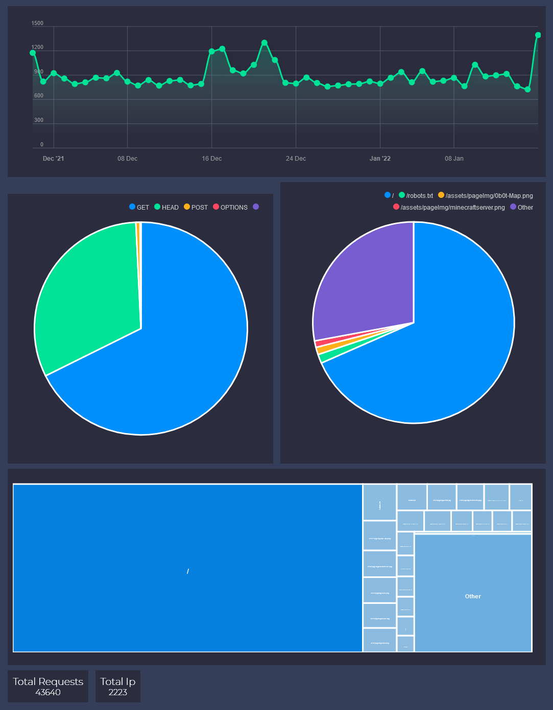

@Title = How my Analytics Work
@Author = Connor Slade
@Date = 01-17-22
@Description = How my custom analytics system for connorcode.com works
@Tags = Analytics, Web Dev, Server, afire, ApexCharts, Log4Shell
@Path = programming/my-analytics
@Assets = .

---

# 📜 How my Analytics Work

I want to be able to see if _anybody_ is interested in my website, but I also care about people's online privacy.
So Google Analytics or anything like it was completely out of the question as it doesn't respect user privacy.
So I decided to write my own analytics system!

## 📚 Requirements

The first step was to figure out what I wanted it to do. This is what I came up with.

It will log every request's `time`, `method`, `user agent` and `referrer`, Each
request will be grouped by the client IP address, and it will save the data in a binary format to save space.
An API route will also be made to remotely retrieve the data (with authentication of course).

## 📀 Implementation

> **Note:** You can see the full implementation on GitHub
> [here](https://github.com/Basicprogrammer10/connorcode/blob/master/src/analytics.rs)

This whole system runs as _pre_ Middleware for [afire](https://crates.io/crates/afire),
So every request it will add the request stats to an internal buffer.
About every hour it will load the analytics file for that day, deserialize
it, merge in the data from the buffer, clear the buffer, re serialize it and save it.

## 📈 Analytics

I made an experimental analytics viewer for this data. It's not even close to being done yet :P.
It's made to use the Analytics API to get the data and [ApexCharts](https://apexcharts.com/) for showing it.

At the top it shows total requests per day, under it shows the 5 most common HTTP methods as well as the 5 most common paths, and below that is a Tree Graph of the 25 most common paths.
It is a bit redundant on the paths, but again It's still _experimental_.
The very bottom has some simple global stats.

## 🚧 Conclusion

I think it's a good start, It's been working very well so far, except for a bug that would cause the API to be like 1000 times slower than it should be (now fixed).

It's been fascinating seeing all the bots that request my site.
Some are just indexing the content, but others try to use known exploits to hack my server.
Recently (as to be expected) the [Log4Shell](https://log4.sh/) exploit has been attempted 22 times on my site.
The payload would be in the User-Agent, Path, Referrer or all of them.

Random PHP exploits have also been tried a lot (635 times),
including WordPress Login attempts (128),
[CVE-2017-9841](https://www.cvedetails.com/cve/CVE-2017-9841/) (86),
Xmlrpc.php Attempts (78) and _more_.

The analytics viewer definitely needs some more work.
At some point I will add the ability to filter data, and show some new metrics.
It may also a good idea to save the data to a database instead of a binary file.

Hopefully you enjoyed this little look into my analytics system!
