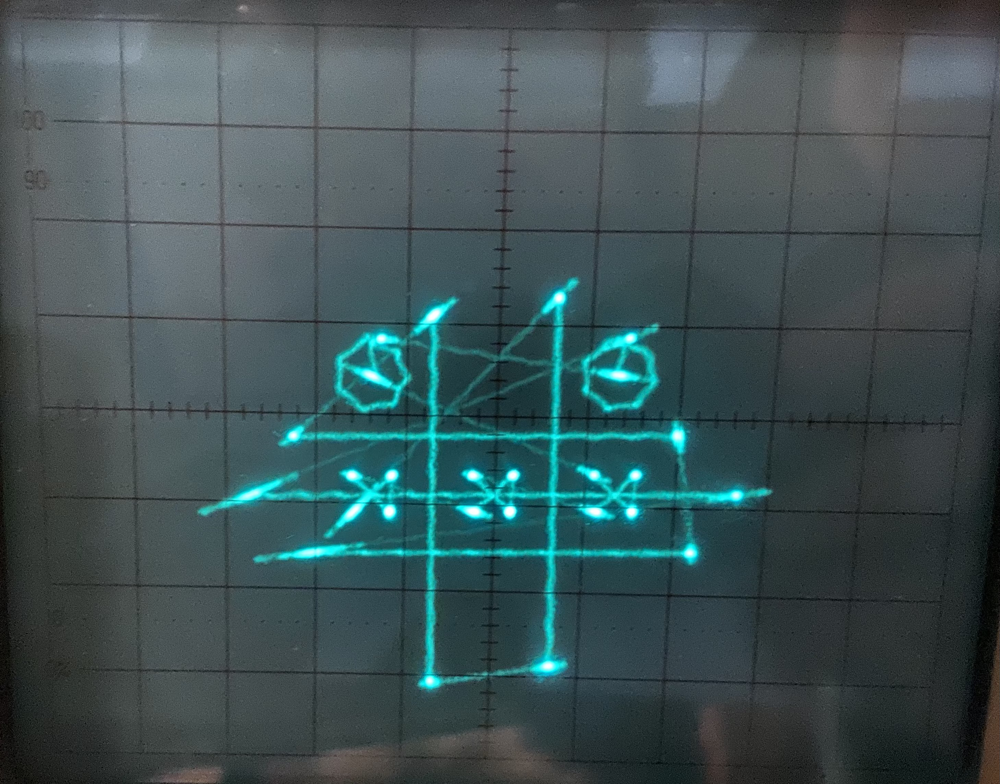

@Title = Oscilloscope Renderer
@Author = Connor Slade
@Date = 04-13-22
@Description = Making a Oscilloscope Rendering system
@Tags = Rust, Renderer, Oscilloscope, Oscilloscope, Renderers
@Path = programming/oscilloscope-renderer
@Assets = .

---

<style>
th {
  font-weight: normal;
  color: #fffc;
}

tr {
	background: #222531 !important;
}
</style>

# 📈 Oscilloscope Renderer

A game rendering system to show 2d vector graphics stuff on an oscilloscope's X-Y mode.
This was for a _hackathon_ thing so there wasn't that much time to work on it.

The source code is on GitHub [here][github-link].

## 🍋 Rendering Theory

So we need a DAC to create the analog signals for this system.
If only there were one of these build into all modern computers...
oh wait,,, audio!

This will be the basis for all of the scope rendering, basically creating sound that translates the beam of an oscilloscope in just the right way to draw something.
The system will just render straight lines to keep it simple for now.
Here is what the position and line structs looks like:

```rust
#[derive(Debug, Clone, Copy, PartialEq)]
pub struct Pos {
    pub x: f32,
    pub y: f32,
}

#[derive(Debug, Clone, Copy)]
pub struct Line {
    pub start: Pos,
    pub end: Pos,
    pub step: f32,
    pub cool_down: bool,
}
```

So now we have a Vec of lines we want to render but how to go about _audifying_ this?
My idea was to take the XY start and go through the positions to the end with the defined step.
Then you just gotta take that value and convert it to an analog signal on both channels.

## 🐌 Renderer Implementation

This part took _wayyyyyyyyyyy_ too long.
A lot of issues came up while working on it.

The first attempt at implementing the render didn't really work as it was based on the slope of the line.
This became an issue on fully horizontal and vertical lines, who knew negative infinity was a thing!?

My partner and I then made it increment through the steps on the line and get to the point there.
However, it's never that easy as the code to continue to the next line when you have gone through all of the lines steps was actually dividing twice.
This caused the lines to be ~10 times longer than they should have been.
We spend hours trying to fix this, we spent like 6 hours just trying to draw a square*!!!*
Here is what we eventually got to:

```rust
// Scale the points from (0 - x, 0 - y) range to (0 - 1, 0 - 1)
let start = scale_pos(line.start, self.size);
let end = scale_pos(line.end, self.size);

// Get the length of the line
let distance = line.distance();
// Get & through the line
let ratio = (line.step * (*inc as f32)) / distance;

// Calc beam pos
let p = Pos::new(
   ratio * end.x + (1.0 - ratio) * start.x,
   ratio * end.y + (1.0 - ratio) * start.y,
);
```

We also had the issue that the scope would try to auto center the things on screen.
I couldn't find anything about this or how to turn it off so we just had to deal with things moving around as stuff changed.

So now the hackathon is halfway over and we are still only rendering static frames when we want a full interactive vector game.

## 🪀 Tic Tac Toe

So we started on the tic-tac-toe board rendering but we ran into a really weird problem.
The trace was osculating along the path.
Looking it up it appears to be 'rigging', this could have been fixed with shorter leads, but there wasn't time for that.

Our solution was to add a cooldown.
This would hold the bean in the same place for a little longer to let the oscillations die down.
This actually worked decently well although it did make bright spots on the begging and end of lines.

_Finally,_ we got the whole tic tac toe rendering system working so it could render a 2D board array to the oscilloscope .
We also had a board checking function to see if and who had won.
At this point there was ~2 hours left and we still had no sort of game loop.

## 🧵 Game loop

In order to give the most flexibility I decided to have the game loop outside the rendering framework.
The render would run in another thread and be sent line vectors over a mpsc channel.

I decided on a 10fps update speed, this value is turned into milliseconds per frame.
The execution time of the loop is times and this is used to make the thread wait just the right time to keep the consistent update speed.
Here is a flow chart showing the processes run on each cycle:



## 🎮 Usage

To pick what place you want to go on the board you use the following keys.
The terminal will say who's turn it is and will block spots that are already taken.
Use the space key to reset the game once it ends.

|  Q  |  W  |  E  |
| :-: | :-: | :-: |
|  A  |  S  |  D  |
|  Z  |  X  |  C  |

## 🎨 Picture



yeah, it looks * *abit* * stringy, it was for a hackathon and my oscilloscope was not cooperating.

## 🧨 Conclusion

We got 2nd place!
and first in my heart,,,
Not bad for my first hackathon and not knowing what's going on or how anything is supposed to work :p.
We won free keyboards, so this hackathon has been almost as profitable as my entire _programming career_ so far.
so thats um, cool.
i definability need to value my time more and charge more but anyway i enjoyed this and i have plans of rf data transition for next year.

[github-link]: https://github.com/Basicprogrammer10/ScopeView
