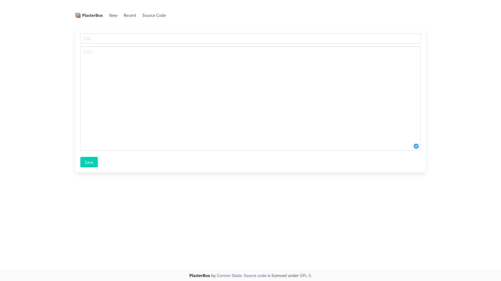

@Title = Plaster Box
@Author = Connor Slade
@Date = 01-30-21
@Description = Introducing PlasterBox, a clean and simple Pastebin
@Tags = PlasterBox, Plaster Box, Pastebin, Paste Bin, Open Source
@Path = programming/plaster-box
@Assets = .

---



# 📦 Plaster Box

Introducing **PlasterBox**! My clean, simple, and open source Pastebin.
Go try it out at [paste.connorcode.com](https://paste.connorcode.com).

> Source code can be found [on GitHub](https://github.com/Basicprogrammer10/plaster-box),

## 🐾 Features

PlasterBox currently only has some planed features, so expect more stuff in the future.

For now you can make new Bins with a Title and Body, and view the other bins in chronological order.
You can get a raw view in plain text of any bin and use the API to make new bins programmatically.

## 📚 Stack

For this project I utilized the _SAAR_ stack – and yes,,, I just made that up now.
Anyway here is what that stands for:

- [**S**ass][sass]
- [**A**lipne.js][alpine]
- [**A**fire][afire]
- [**R**ust][rust]

### 🐸 Frontend [SA]

In the front end I used the [Sass][sass] CSS preprocessor and [Alpine.js][alpine] the lightweight JS framework.
I also used the [Bulma][bulma] the CSS framework.
This was simply because I had never used one before :p.
I liked using a CSS framework and I think for the next web app I make I will look into [tailwindcss][tailwindcss].

### 🦓 Backend [AR]

As always I used Rust for the backend with my web server framework [afire][afire].
This app is mostly server side rendered, only using JavaScript for submitting the form, resizing the text box and the Raw / Copy buttons.

Each _bin_ or paste is defined with the following `struct`.
Each bin has a UUID, the stored text, a name, and the time of creation.

```rust
#[derive(Debug, Serialize, Deserialize)]
pub struct Bin {
    uuid: [u8; 16],
    data: String,
    name: String,
    time: u64,
}
```

For storing the data I'm just using [bincode][bincode] to serialize / deserialize the bins into / from bytes.
I probably should use a database, but I don't really like any of the options available.

## 📀 API

The PlasterBox API allows you to create and view Bins.

All of the following examples are in Rust and make use of [ureq][ureq].
To add it to your cargo project add the following to the dependency section of your `Cargo.toml`.

```toml
[dependencies]
ureq = "2.4.0"
```

### 📰 Create a New Bin

The frontend web app uses this same API to create bins.
It's used by sending a `POST` to `/new` with the text defined in the request body and the title in the `Name` header.

Here is an example program to create a new bin.

```rust
const URI: &str = "http://paste.connorcode.com";

fn main() -> Result<(), ureq::Error> {
    let body: String = ureq::post(&format!("{URI}/new"))
        .set("Name", "Title")
        .send_string("Body!")?
        .into_string()?;

    println!("{URI}/b/{body}");
    Ok(())
}
```

## 🦙 View a Bin

This is super simple and can be done by sending a `GET` request to `/raw/{UUID}`.
Like before here is an example program.

```rust
const URI: &str = "http://paste.connorcode.com";
const UUID: &str = "971d0341-fca1-4cc7-a463-a962314b7b56";

fn main() -> Result<(), ureq::Error> {
    let body: String = ureq::get(&format!("{URI}/raw/{UUID}"))
        .call()?
        .into_string()?;

    println!("{}", body);
    Ok(())
}

```

<!-- Links -->

[sass]: https://sass-lang.com/
[alpine]: https://alpinejs.dev/
[afire]: https://crates.io/crates/afire
[rust]: https://www.rust-lang.org/
[bulma]: https://bulma.io/
[tailwindcss]: https://tailwindcss.com/
[bincode]: https://crates.io/crates/bincode
[ureq]: https://crates.io/crates/ureq
