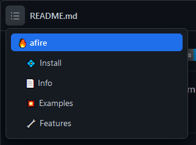

@Title = Table of Contents
@Author = Connor Slade
@Date = 02-23-22
@Description = Adding a table of contents to my articles
@Tags = Programming, Web Development, Table of Contents
@Path = programming/table-of-contents
@Assets = .

---

# 🏓 Table of Contents

In this article, I will walk through my process of adding a table of contents or TOC to my articles.
The button is right next to the like button. Give it a try!

## 🌵 Planning

Yep. Its planning time.

I needed a little inspiration on this, so I looked at the GitHub README table of contents.
As you can see, it is a box the shows up with the headings, each one being indented more.
Above it there is a button to activate it.



For mine, I wanted to put the button next to the like button.
I think that's enough planning for now :p

## 🎯 Execution

The next thing I did was to make the visual design.
I started by adding a new button by the like button and creating a div to make the Table of contents with.
I then painstakingly set the background color and gave the contents items a hover background.
Here is the styling I ended up with:

```scss
// Main Contents Box
& .contents {
  box-shadow: 0 5px 10px 3px #00000080;
  background: #323546;
  border-radius: 12px;
  position: absolute;
  margin-top: 8px;
  padding: 10px;

  // The contents items
  & div {
    padding: 5px;
    border-radius: 4px;
    cursor: pointer;

    &:hover {
      background: #272937;
    }
  }
}
```

Now to make it automatically fill the TOC based off of the article.
I made a new function `initContents` to well initialize the contents, this funcion is called on page load.
It loops through the elements of the article and if they are headers it will make a new div in the TOC and give it a left padding based off of the header type (`n * 2 em`).
So an `h1` gets no extra padding, an `h2` gets 2em of padding, `h3` gets 4em of padding, etc.
It then adds a click event listener to the div and finally appends it to the TOC.
Here is the final code:

```js
const TAGS = ["H1", "H2", "H3", "H4", "H5"];
function initContents() {
  let contentsButton = [
    document.querySelector("[contents-button]"),
    document.querySelector("[contents-button-icon]"),
  ];
  let contentsDropdown = document.querySelector("[contents-dropdown]");
  // Get the articles elements
  let elements = Array.from(document.querySelector("article").children);

  // Loop through the elements
  elements.forEach((e) =>
    // Loop through the header tags
    TAGS.forEach((eName, offset) => {
      // Check if this elements is the current header tag
      if (e.tagName !== eName) return;

      // Create a new item element
      let ele = document.createElement("div");
      // Set its content to the content of the header
      ele.innerText = e.innerText;
      // Set its padding
      ele.style.paddingLeft = `${2 * offset}em`;

      // Add event listaner to goto that section
      ele.addEventListener("click", () => {
        window.location = e.children[0].href;
      });

      // Add element to the TOC
      contentsDropdown.appendChild(ele);
    })
  );

  // Event listanerr for opening and closing the TOC
  document.addEventListener("click", (e) => {
    if (contentsButton.includes(e.target)) {
      contentsDropdown.classList.toggle("hidden");
      return;
    }

    contentsDropdown.classList.add("hidden");
  });
}
```

## 🥝 The Result

Here it is!


## 🧱 Conclusion

Well this sure was a quick article!
I think adding a table of contents to an article is a great way to help a reader quickly navigate to the section they are interested in.
I hope you found the result and this article helpful!
