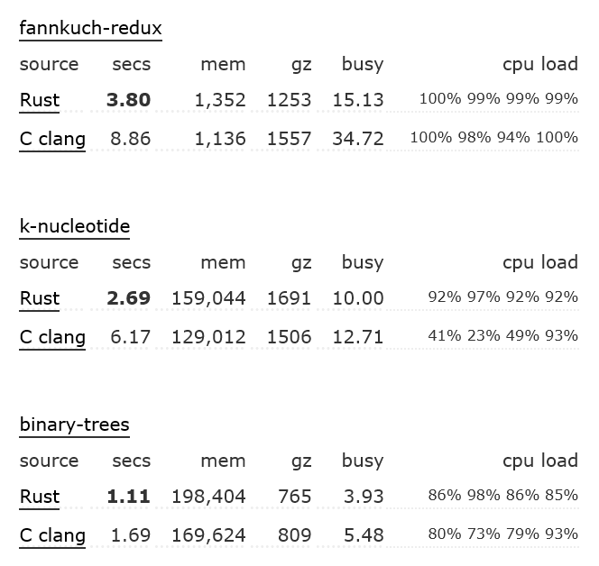
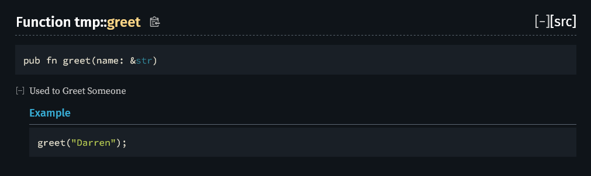
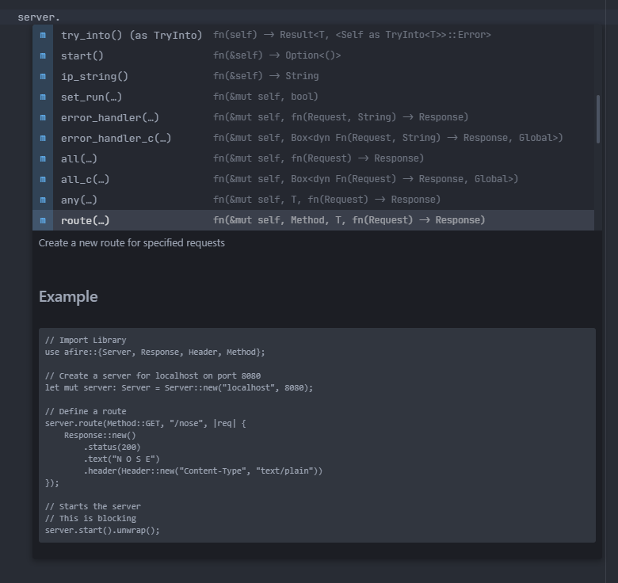

@Title = Why I Love Rust
@Author = Connor Slade
@Date = 01-18-21
@Description = Why I Love the Rust Programming Language and where it needs Improvement
@Tags = Programming, Software Development, Rust, Rust Lang, Ferris
@Path = programming/why-i-love-rust
@Assets = .

---

# 🦀 Why I Love Rust

The Rust programming language is a relatively new programming language that was designed to be fast, safe, and concurrent.
It is a systems programming language that has been gaining traction over the past few years.
On the [2021 Stack Overflow Survey](https://insights.stackoverflow.com/survey/2021) Rust is the **most loved** language.
This is the 6th year rust had been voted most loved. People definitely love Rust, but why?
In this article I will explain why **I** like rust, and at the end I will touch on some improvements it needs.


## ✨ Why It's Great

To me rust feels like a mix of the best parts from `C++`, `JavaScript` and `Python`.
Here I will show some amazing parts of rust!

### 🚄 Speed

First off lets touch on the speed of the language.
It is a compiled language, so it gets similar speed to the C family of languages.
According to tests at [The Benchmarks Game](https://benchmarksgame-team.pages.debian.net/benchmarksgame/fastest/rust-clang.html) Rust often out preformed `C Clang` a or was very close.

Here are the first three tests



### ✨ Error Handling ✨

This may be my favorite part of rust! Rust has a very different and elegant error handling philosophy.

In most languages errors must be caught in ugly try/catch blocks. In rust there is no trying!
Instead of crashing rust panics, panicking terminates the program immediately providing a message to the caller.
But panic should be used when a program reaches an unrecoverable state. The rest of the time you should use `Option`s and `Result`s.

You can use `Result<Sucess, Failure>` as a return type from a function.
Within the function you will either return `OK(Sucess)` or `Err(Failure)`.

When you don't want an error type you can use a `Option`.
With options, you will either return `None` or `Some(Sucess)`.

Example Time! If you want to play with the example check it out on the [Plaground](https://play.rust-lang.org/?version=stable&mode=debug&edition=2021&gist=3d92bd4da853496ff2ac32a16c335325).

```rust
// Parse the Key Value data and make make sure it returned a sucessfull
// ["Hello", "World"]
assert_eq!(parse_key_value("Hello = World"), Some(["Hello", "World"]));

// Try to parse Invalid Key Value Data
// Make sure None is returned
assert_eq!(parse_key_value("Hello World"), None);

fn parse_key_value(inp: &str) -> Option<[&str; 2]> {
    // Try to split input by '=', split_once itself returns an option
    // so if it is `None` the `?` operator will pass it through
    // But if everything is good it will unwap the Option
    let parts = inp.split_once('=')?;

    // Get and Trim the Key
    let a = parts.0.trim();

    // Get and Trim the Value
    let b = parts.1.trim();

    // Return a Sucessfull Value
    Some([a, b])
}
```

If you are sure it was successful you can `.unwrap()` the option.
Calling unwrap on a None it will panic the thread.

If you just want to run some code if it was successful you can use an `if let` statement.

```rust
// Make a new Option
let a = Some("Darren");

// If a is a Some run the code with i being the upwraped value
if let Some(i) = a {
  println!("Hello {i}");
}
```

Now a quick Result Example, also on the [Plaground](https://play.rust-lang.org/?version=stable&mode=debug&edition=2021&gist=b288e50546a71fed4a01179b90747a28).
This is just like the previous example but just will Results.
In this case a Result is overkill but if a function could have multiple different errors this is the bettor solution.

```rust
assert_eq!(parse_key_value("Hello = World"), Ok(["Hello", "World"]));

assert_eq!(parse_key_value("Hello World"), Err(KeyValueError::SplitError));

// Type to return on error
#[derive(Debug, Eq, PartialEq)]
enum KeyValueError {
    SplitError,
}

fn parse_key_value(inp: &str) -> Result<[&str; 2], KeyValueError> {
    let parts = match inp.split_once('=') {
        Some(i) => i,
        None => return Err(KeyValueError::SplitError)
    };

    let a = parts.0.trim();
    let b = parts.1.trim();

    Ok([a, b])
}
```

### ⛔️ Error Messages

One thing rust is often praised for is its error messages.
They not only tell you what the problem is but will typically tell how to fix it.

Starting off with a rather simple example:

```rust
let nums = vec![1, 2, 3, 4];
println!("Thare are {} Numbers!", nums.len);
```

Trying to build this code will produce the following error message.

```text
error[E0616]: field `len` of struct `Vec` is private
 --> src/main.rs:2:44
  |
2 |     println!("Thare are {} Numbers!", nums.len);
  |                                            ^^^ private field
  |
help: a method `len` also exists, call it with parentheses
  |
2 |     println!("Thare are {} Numbers!", nums.len());
  |                                               ++

For more information about this error, try `rustc --explain E0616`.
```

It not only tells you the issue, in this case that the length field is private.
But it gives a possible solution of using the `.len()` method.

This next example is much more sneaky. Even if you know rust you may not be able to see the issue.

```rust
println!("Hello, World!");
```

Yep, that's all. See if you can find the issue. I'll wait.

Trying to build this will yield the following message:

```text
error: unknown start of token: \u{37e}
 --> src/main.rs:1:26
  |
1 | println!("Hello, World!");
  |                          ^
  |
help: Unicode character ';' (Greek Question Mark) looks like ';' (Semicolon), but it is not
  |
1 | println!("Hello, World!");
  |                          ~
```

Yes the `;` is actually not a semicolon, but the rust compiler shows the issue and again shows how to fix it.

### 📖 Documentation

Rust has great Documentation in two ways.

The **first way** is Actual Documentation, when you are getting started with rust there is [The Rust Book](https://doc.rust-lang.org/stable/book/).
It teaches the important concepts offo rust, going from printing `"Hello World"` to making a webserver.
The [Standard Library](https://doc.rust-lang.org/std/) is also very well documented with clear information and lots of examples.

The **second way** is with [Rust Doc](https://doc.rust-lang.org/rustdoc/index.html), which is a program to generate Documentation pages from Doc comments on Functions, Structs, Enums, etc.
These doc comments support Markdown, including Code Blocks that are actually tested like unit tests.

> Its job is to generate documentation for Rust projects.
> On a fundamental level, Rustdoc takes as an argument either a crate root or a Markdown file, and produces HTML, CSS, and JavaScript.
>
> — [The Rust Doc Documentation](https://doc.rust-lang.org/rustdoc/index.html)

For example if I have the following function:

````rust
/// Used to Greet Someone
///
/// ## Example
/// ```rust
/// greet("Darren");
/// ```
pub fn greet(name: &str) {
  println!("Hello {name}!");
}
````

I can build and open the docs with this command

```bash
cargo doc --open
```

Here we can see the final output of the documentation



### 🧰 Comprehensive Standard Library

The rust environment is more than just the language itself. It is made up of different libraries and tools.
The most extensive library is the [Rust Standard Library](https://doc.rust-lang.org/std/) or `STD`.

> The Rust Standard Library is the foundation of portable Rust software, a set of minimal and battle-tested shared abstractions for the broader Rust ecosystem.
>
> — [STD Docs](https://doc.rust-lang.org/std/)

Instead of needing to write different code for different platforms like in C++ that is all handled in the Standard Library.
So we can rust call a standard function on any platform and get the same expected result.

For an example lets check if a file exists.

#### C++

```cpp
bool exists(const std::string &name) {
    if (name.empty()) return false;
#if defined(WIN32) || defined(_WIN32) || defined(__WIN32) && !defined(__CYGWIN__)
    struct stat buffer{};
    return (stat(name.c_str(), &buffer) == 0);
#else
    std::ifstream file(name);
    return file.is_open();
#endif
}
```

As you can see you need to check if the code is being compiled for windows or not and change that code is used.

#### Rust

```rust
fn exists(file: &str) -> bool {
  std::path::Path::new(file).exists()
}
```

The Rust version does not directly use any operating system specific code, making it much cleaner and easier to work with / test.

Now for an even more complex example let's make a simple Web Server in both languages.

#### C++

This code if modified from Adrian Novelo at [ncona.com](https://ncona.com/2019/04/building-a-simple-server-with-cpp/).

```cpp
#include <sys/socket.h> // For socket functions
#include <netinet/in.h> // For sockaddr_in
#include <cstdlib> // For exit() and EXIT_FAILURE
#include <iostream> // For cout
#include <unistd.h> // For read

int main() {
  // Create a socket (IPv4, TCP)
  int sockfd = socket(AF_INET, SOCK_STREAM, 0);
  if (sockfd == -1) {
    std::cout << "Failed to create socket. errno: " << errno << std::endl;
    exit(EXIT_FAILURE);
  }

  // Listen to port 9999 on any address
  sockaddr_in sockaddr;
  sockaddr.sin_family = AF_INET;
  sockaddr.sin_addr.s_addr = INADDR_ANY;
  sockaddr.sin_port = htons(9999); // htons is necessary to convert a number to
                                   // network byte order
  if (bind(sockfd, (struct sockaddr*)&sockaddr, sizeof(sockaddr)) < 0) {
    std::cout << "Failed to bind to port 9999. errno: " << errno << std::endl;
    exit(EXIT_FAILURE);
  }

  // Start listening. Hold at most 10 connections in the queue
  if (listen(sockfd, 10) < 0) {
    std::cout << "Failed to listen on socket. errno: " << errno << std::endl;
    exit(EXIT_FAILURE);
  }

  // Grab a connection from the queue
  auto addrlen = sizeof(sockaddr);
  int connection = accept(sockfd, (struct sockaddr*)&sockaddr, (socklen_t*)&addrlen);
  if (connection < 0) {
    std::cout << "Failed to grab connection. errno: " << errno << std::endl;
    exit(EXIT_FAILURE);
  }

  // Read from the connection
  char buffer[100];
  auto bytesRead = read(connection, buffer, 100);
  std::cout << "Client > " << buffer;

  // Send a message to the connection
  std::string response = "Hello, World\n";
  send(connection, response.c_str(), response.size(), 0);

  // Close the connections
  close(connection);
  close(sockfd);
}
```

As you can see this is fairly complicated, but it also only works for Linux systems.

#### Rust

```rust
use std::io::prelude::*;
use std::net::TcpListener;

fn main() {
    // Init TCP Listener
    let listener = TcpListener::bind("127.0.0.1:9999").unwrap();

    for stream in listener.incoming() {
        let mut stream = stream.unwrap();
        let mut buffer = [0; 100];

        // Read Client Data
        stream.read(&mut buffer).unwrap();
        println!("Client > {}", String::from_utf8_lossy(&buffer[..]));

        // Send Data
        stream.write("Hello, World".as_bytes()).unwrap();
        stream.flush().unwrap();
    }
}
```

The rust version of this program is a lot shorter and easier to understand, and is also cross-platform giving it a huge advantage over C++.

### 🗻 Ownership

> Ownership is a set of rules that governs how a Rust program manages memory.
> Some languages have garbage collection that constantly looks for no-longer used memory as the program runs; in other languages, the programmer must explicitly allocate and free the memory.
> Rust uses a third approach: memory is managed through a system of ownership with a set of rules that the compiler checks.
>
> — [The Rust Book](https://doc.rust-lang.org/book/ch04-01-what-is-ownership.html)

Languages such as Java, Go, JavaScript, Python and Haskell use garbage collection to manage memory.
One problem with garbage collection is that it uses system resources when deciding what to free.
A [paper](https://people.cs.umass.edu/~emery/pubs/gcvsmalloc.pdf) found that garbage collection needs five times the memory to perform as fast as the same program using explicit memory management.

Manually handling memory like in C _can_ be the most efferent way but it also much more difficult and error-prone.

Rusts ownership system is like a middle ground. There is no garbage collection, but you don't need to manage memory yourself.
Let's see the rules for rust's ownership:

- Each value has an owner variable
- There can only be one owner at a time
- When the owner goes out of scope, the value will be dropped

### 📦 Cargo

This is a big one!

> Cargo is the Rust package manager.
> Cargo downloads your Rust package's dependencies, compiles your packages, makes distributable packages, and uploads them to crates.io, the Rust community’s package registry.
>
> — [Cargo Documentation](https://doc.rust-lang.org/cargo/)

Basically it makes creating, building, running, testing, documenting and benchmarking easier.
You can use Cargo to easily use other libraries with your programs.
But Cargo is much more…

Cargo can make use of other programs like [Rust FMT](https://github.com/rust-lang/rustfmt) for code formatting and
[Rust Clippy](https://github.com/rust-lang/rust-clippy) for catching common mistakes in your code.
You can even add your own sub commands to Cargo.

#### 🧁 Rust FMT

Let's say we have the following code to normalize an HTTP path (from [afire](https://github.com/Basicprogrammer10/afire)).
(_yes,,, i had to make this messy lol_)

```rust
fn normalize_path(mut path:String) -> String {
  if path.ends_with ( '/' )
  {      path.pop();
  }

      if !path.starts_with('/') {
            path.insert(0, '/');

      }

    path
      }
```

By running Rust FMT (`cargo fmt`) our messy code will be made into the following

```rust
fn normalize_path(mut path: String) -> String {
    if path.ends_with('/') {
        path.pop();
    }

    if !path.starts_with('/') {
        path.insert(0, '/');
    }

    path
}
```

You can see how It fixed the indentation, spacing, and extra new lines.
As great is it is we sometimes want to keep specific formatting, for that you can use `#[rustfmt::skip]` attribute.
Personally I have my text editor format the file on save.

#### ✂ Cargo Clippy

[Clippy](https://github.com/rust-lang/rust-clippy) has over 500 [lints](https://rust-lang.github.io/rust-clippy/master/index.html) to catch common mistakes and improve your Rust code.

Like before lets look at an example. I tried to cram a lot of problems into this :P.
At first glance it may look like it works, when running it does give a correct looking response for the circumference.

```rust
let mut e = 3.14;
let mut pi = 2.71;

// Swap `e` and `pi`
pi = e;
e = pi;

// Calculate circumference
let circumference = 2.0 * pi * 10.0;

// Print Results
println!("PI: {pi}");
println!("E: {e}");
println!("Circumference: {circumference}");

assert!(true)
```

Let's now run Rust Clippy (`cargo clippy`).

```text
warning: value assigned to `pi` is never read
 --> src/main.rs:3:13
  |
3 |     let mut pi = 2.71;
  |             ^^
  |
  = note: `#[warn(unused_assignments)]` on by default
  = help: maybe it is overwritten before being read?

error: this looks like you are trying to swap `pi` and `e`
 --> src/main.rs:5:5
  |
5 | /     pi = e;
6 | |     e = pi;
  | |__________^ help: try: `std::mem::swap(&mut pi, &mut e)`
  |
  = note: `#[deny(clippy::almost_swapped)]` on by default
  = note: or maybe you should use `std::mem::replace`?
  = help: for further information visit https://rust-lang.github.io/rust-clippy/master/index.html#almost_swapped

error: approximate value of `f{32, 64}::consts::PI` found
 --> src/main.rs:2:17
  |
2 |     let mut e = 3.14;
  |                 ^^^^
  |
  = note: `#[deny(clippy::approx_constant)]` on by default
  = help: consider using the constant directly
  = help: for further information visit https://rust-lang.github.io/rust-clippy/master/index.html#approx_constant

warning: `assert!(true)` will be optimized out by the compiler
  --> src/main.rs:14:5
   |
14 |     assert!(true)
   |     ^^^^^^^^^^^^^
   |
   = note: `#[warn(clippy::assertions_on_constants)]` on by default
   = help: remove it
   = help: for further information visit https://rust-lang.github.io/rust-clippy/master/index.html#assertions_on_constants

warning: `playground` (bin "playground") generated 2 warnings
error: could not compile `playground` due to 2 previous errors; 2 warnings emitted
```

Ok,,, you gotta admit it's a little impressive to put that many issues in so little code.
Anyway it not only shows what the issue is, but it will often show how to fix it.
Using these errors and suggestions our code becomes the following.

```rust
let mut e = std::f32::consts::PI;
let mut pi = std::f32::consts::E;

std::mem::swap(&mut pi, &mut e);

let circumference = 2.0 * pi * 10.0;

println!("PI: {pi}");
println!("E: {e}");
println!("Circumference: {circumference}");
```

This is a rather extreme example, but especially when starting in rust this tool is incredibly useful.
Even now I will occasionally make a mistake that I wouldn't have even noticed without Clippy.

#### 🕯 Cargo Test

Unit testing can be very importent for writing great, bug free software.
Most languages don't have a built-in system for unit testing and rely on of other frameworks.
Rust's built-in unit testing makes unit testing even easier to get into.

_Example Time!_ As always this is on the playground [here](https://play.rust-lang.org/?version=stable&mode=debug&edition=2021&gist=de8db9637d77e3e4059d223864bdf4af).

```rust
// Define a function to test
fn greet(name: &str) -> String {
    format!("Hello, {name}!")
}

// Make a testing function
// Use the `test` attribute to define it as a test
#[test]
fn test_greet() {
    // Assert some things
    assert_eq!(greet("Darren"), "Hello, Darren!");
}
```

We can run out unit test with `cargo test`.

```text
running 1 test
test test_greet ... ok

test result: ok. 1 passed; 0 failed; 0 ignored; 0 measured; 0 filtered out; finished in 0.01s
```

As you can see it reports that all tests have passed.
With this you can set up a continuous integration system to test your code on every git push / pr.
This is what I have set up for my website and most of my other projects too.

### 🎈 Crates.io

[Crates.io](htpps://crates.io) is the official rust package repository.
It's similar to [NPM](https://npmjs.com) for JavaScript.
At the time of writing Crates.io has `74,962` Crates, anybody can use or add crates.

There are crates for everything from Loggers to Machine Learning.
This website uses `151` different crates (`13` directly).

This is interesting because not many Lower Level languages like Rust, C, C++, etc. have an official Package repository and manager.
On C++ for example installing a dependency consists of downloading the library and putting the source code in your project directory.
In Rust installing a package is as easy as adding one line to the project's Cargo.toml.

This section is a bit short so, How about an Example?
Here is an example `Cargo.toml` that's adds afire (my webserver framework) into your project.

```toml
[package]
name = "<PROJECT_NAME>"
version = "0.1.0"
edition = "2021"

[dependencies]
afire = "0.2.3" # Note at this point this may be an old version
```

### 📜 Rust Analyzer

[rust-analyzer](https://rust-analyzer.github.io/) is a library for semantic analysis of Rust code.
It can be used to let IDEs and Text Editors get information on rust projects, it can being the following features to your editor.

- Syntax Highlighting
- Code Completion
- Annotations
- Macro Expansion
- Find All References
- Go to Definition
- Inlay Type Hints
- Error _Squiggles_
- _More_

In this screenshot you can see how my text Editor ([atom](https://atom.io/)) is showing autocomplete options with rust-analyzer.



This is less of a language feature, but it makes the development process much easier because of the features mentions above and the ability for it to highlight errors right in your code.

### 🐡 TurboFish

This is a smaller feature but it frequently comes in handy.
TurboFish as it is typically called is a way of passing a type to a function that returns a Generic.
It is needed when the compiler cant infer the type.
It is much cleaner than having to assign the value to a variable with an explicit type if you are going to use it again after.

Here is an example that gets the amount of even numbers in a Vector

```rust
let x = vec![1, 2, 3, 4, 5, 6, 7, 8];
let y = x.iter().filter(|x| *x % 2 == 0).collect().len();

assert_eq!(y, 4);
```

When trying to compile this we get this error

```text
error[E0282]: type annotations needed
 --> src/main.rs:3:46
  |
  |     let y = x.iter().filter(|x| *x % 2 == 0).collect().len();
  |                                              ^^^^^^^ cannot infer type for type parameter `B` declared on the associated function `collect`
  |
  = note: type must be known at this point
```

If we were to add the type `usize` to the variable definition this would not help, as the type is needed before then.
To fix this we could remove the `.len()` and add the type `Vec<_>` to the variable `y` and redefine it later, but this is messy.
With turbo fish this can be fixed by changing line `2` to the following

```rust
let y = x.iter().filter(|x| *x % 2 == 0).collect::<Vec<_>>().len();
```

The underscore tells the compiler to infer the type.
In this case it just needed to know that we were collecting into a Vector.
Now it compiles and runs perfectly. _Cool Beans_!
Check it out on the playground [here](https://play.rust-lang.org/?version=stable&mode=debug&edition=2021&gist=c2a1c22ebfb8287e251312760decdf01).

### </img> Ferris

As this is the final positive point in this article it's the **most important**.

Rust has one of the **_Cutest_** mascots of any programming language.
Meet Ferris the Crab, unofficial mascot for Rust.


Head to [rustacean.net](https://www.rustacean.net/) for more Ferris!

## 🧊 Ways to Improve

Now as much as I love rust there are some things that still need improvement, as there are with anything.

### 🎀 Young Library Ecosystem

In languages like python there are packages for everything, the Python Package Index (PyPI) has over `352k` packages.
In rust there are lots of packages but not nearly as many as thare are in more mature ecosystems.
For things like [Web Frameworks](https://www.arewewebyet.org/) and [Asynchronous](https://areweasyncyet.rs/) rust has great libraries.
However, when it comes to [Machine Learning](https://www.arewelearningyet.com/), [GUI](https://areweguiyet.com/) and lots of other stuff we have a way to go.

This is something that will improve with time as projects develop and more people help.

### 📈 Learning Curve

I first started with rust `11 months` ago, so I don't really remember how long it took for me to really understand everything.
From looking at old project commits it looks like it took a few months.

Learning rust is more than just learning its syntax, rust requires knowing more about low level computing principles.
So coming from high level languages rust may take longer to learn.

## 🚧 Conclusion

This is my longest article to date :P.
I spent about a week on it and its ~3000 words.
I hope you enjoyed this and learned something new.

All in all, Rust is an amazing language.
It may be a bit difficult to learn but doing so unlocks a new world of programming.
Coming from C, C++ or any low level language rust is a nice upgrade in safety and consistency and from high level languages rust is a huge boost in terms of speed and reliability.
It's a good fit for backend web development and a Great fit for Driver and embedded system programming.

This article has a lot of content and as such it also has lots of possible errors.
If you find anything inaccurate you can file an [Issue](https://github.com/Basicprogrammer10/connorcode-writing/issues) or submit a [PR](https://github.com/Basicprogrammer10/connorcode-writing/pulls)

- Connor Slade
