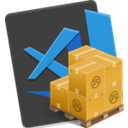

@Title = Rust Tutorial
@Author = Connor Slade
@Date = 07-08-22
@Description =
@Tags =
@Path = rust-tutorial/setting-up-the-environment
@Assets = .

---

<link rel="stylesheet" href="../assets/rust-tutorial/style.css" />
<style>
  [extension-icon] {
    width: 100px;
    border-radius: 0;
  }
</style>

# Rust Tutorial &mdash; Setting Up the Environment

To start programming in Rust, you first need to install the toolchain.

<div ad note>
Note

If you want to just play around with Rust online without installing the toolchain just yet, you can use:

- [The Official Rust Playground](https://play.rust-lang.org)
- [Rust Explorer](https://www.rustexplorer.com)

I personally prefer Rust Explorer because its output streams in real time and the editor is nicer with tab-completions and the ability to hover any keyword or function to get more info.

</div>

## Rustup

The best, and officially supported, way to install the rust toolchain is with a tool called called `rustup`.
You can install it from [rustup.rs](https://rustup.rs), or just follow the below instructions for your platform.

---

Linux:

```bash
# Install build tools
sudo apt install build-essential

# Download and run rustup-init
curl --proto '=https' --tlsv1.2 -sSf https://sh.rustup.rs | sh
```

---

Windows:

You will need to have already installed [Visual Studio C++ Build tools](https://visualstudio.microsoft.com/visual-cpp-build-tools).
This contains the compiler backend stuff that the rust compiler uses behind the scenes.

- [64-bit Installer](https://win.rustup.rs/x86_64)
- [32-bit Installer](https://win.rustup.rs/i686)

---

Now that you've run rustup, you should get a menu in the terminal that looks like this:

```text
   default host triple: x86_64-unknown-linux-gnu
     default toolchain: stable (default)
               profile: default
  modify PATH variable: yes

1) Proceed with installation (default)
2) Customize installation
3) Cancel installation
>
```

Select 1, for Proceed with installation.
If all goes well you should then get the following message:

```text
Rust is installed now. Great!

To get started you may need to restart your current shell.
This would reload your PATH environment variable to include
Cargo's bin directory ($HOME/.cargo/bin).

To configure your current shell, run:
source "$HOME/.cargo/env"
```

Run the specified command, this will let you use the newly installed commands in your current terminal.
To make sure everything works, run `cargo -V` and you should see it print the currently installed version.

## Cargo

Cargo is the build tool for rust that manages project creation, compiling, dependency management, formatting, linting, etc.
To create your first project you can cd into the folder you want to store the project in and run `cargo new <name>`.
Now might be a good time to go over some relevant terminology:

- **module** &mdash; Kinda like a namespace.
  If you are in a particular module, you can access the items in that module but if you are in a different module you will have to import them.
- **crate** &mdash; According to the Rust Rust Book, a "crate is the smallest amount of code that the Rust compiler considers at a time.
  Crates are often made of many different modules, and can either be binaries or libraries.

<div ad note>
Note

All identifiers in rust should be snake case (snake_case), this is also true for crate names.
So when making a new project make sure the name is using the correct caseing.

</div>

So now lets make a new crate for use in the next lesson.
We will call it `hello_world` (but feel free to change the name if you would like).
Run `cargo new hello_world` to make the base project structure.

```text
➜ cargo new hello_world
     Created binary (application) `hello_world` package

➜ cd hello_world/

hello_world on  master [?] is 📦 v0.1.0 via 🦀 v1.72.0-nightly
➜ tree
.
├── Cargo.toml
└── src
    └── main.rs
```

We will take a look into each of these files in the next chapter.

## Editor Setup

For this section, I will setup [Visual Studio Code](https://code.visualstudio.com) for Rust development.
You can also try to follow along with another text editor if you would prefer.

| Icon                                                                                                 | Name                                                                                               | Description                                                                                                                                                                                                                                                                                                                                     |
| ---------------------------------------------------------------------------------------------------- | -------------------------------------------------------------------------------------------------- | ----------------------------------------------------------------------------------------------------------------------------------------------------------------------------------------------------------------------------------------------------------------------------------------------------------------------------------------------- |
|     | [rust&ndash;analyzer](https://marketplace.visualstudio.com/items?itemName=rust-lang.rust-analyzer) | **Rust language support for Visual Studio Code.** This is defiantly the most important extension on this list, it adds so many features like tab completion, documentation on hover, and error info.                                                                                                                                            |
|  | [Even Better TOML](https://marketplace.visualstudio.com/items?itemName=tamasfe.even-better-toml)   | **Fully-featured TOML support.** Adds syntax highlighting, validation, folding and more for TOML files. (Which are often used in the rust ecosystem)                                                                                                                                                                                            |
|         | [CodeLLDB](https://marketplace.visualstudio.com/items?itemName=vadimcn.vscode-lldb)                | **A native debugger powered by LLDB. Debug C++, Rust and other compiled languages.** A debugger you can use on your rust projects. I don't end up using this too often but it could be useful.                                                                                                                                                  |
|            | [crates](https://marketplace.visualstudio.com/items?itemName=serayuzgur.crates)                    | **Helps Rust developers managing dependencies with Cargo.toml. Only works with dependencies from crates.io.** (Optional) Useful for checking, at a glance if your dependencies are out of date.                                                                                                                                                 |
|       | [Error Lens](https://marketplace.visualstudio.com/items?itemName=usernamehw.errorlens)             | **Improve highlighting of errors, warnings and other language diagnostics.** (Optional) This one is very much personal preference, but I like it so Im shareing it here. It makes errors and warnings from rust&ndash;analyzer (and other language servers) stand out more but highlighting the line and putting a text description next to it. |

<div page-links>

| [Previous Chapter](/writing/rust-tutorial) | [Next Chapter](/writing/rust-tutorial/hello-world) |
| ------------------------------------------ | -------------------------------------------------- |

</div>
