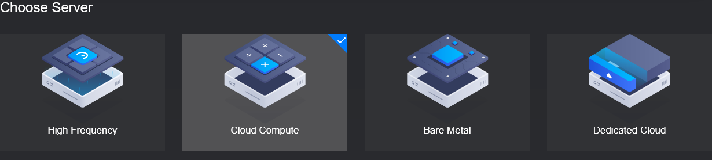
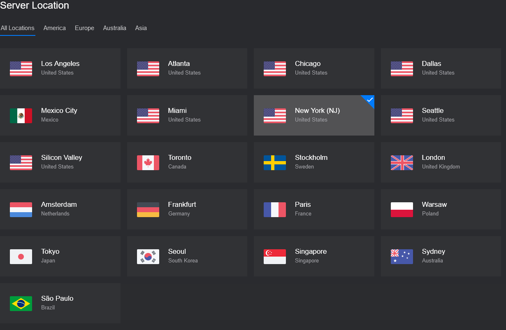
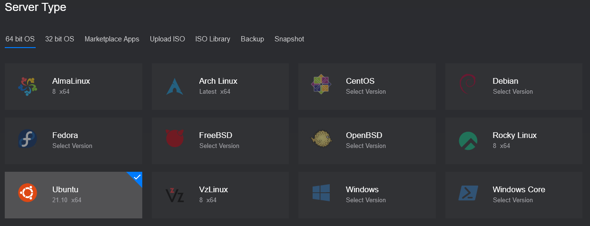
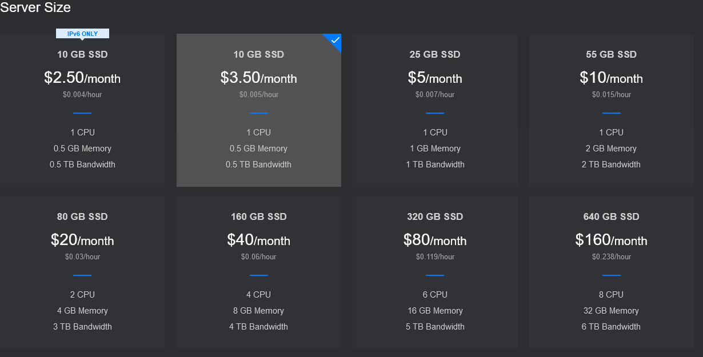
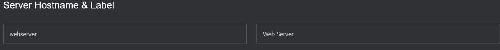
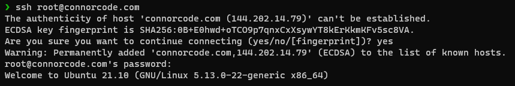
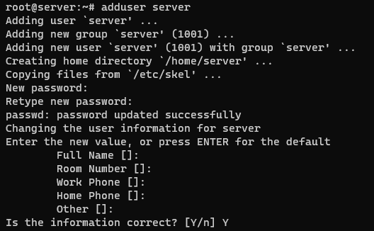
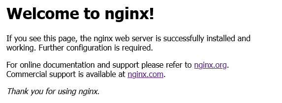
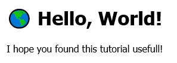

@Title = Tutorial: Hosting a Web app
@Author = Connor Slade
@Date = 01-13-22
@Description = Learn how to host a web app with a reverse proxy on Vultr.
@Tags = Website, Web app, Vultr, Nginx
@Path = tutorial/web-hosting
@Assets = .

---

# 🐍Tutorial: Hosting a Web app

> Around 576,000 new websites are created every signal day.

So lets see how to host one on your own.
This article is about site hosting, not creation so this assumes that you already have a website.

### 🎯 Getting a Domain

This is an optional step but is important if you want a TLS certificate or just to have a more memorable way to access your site.
A domain is an identifier that (through the DNS system) links to the IP address of your web server.
This article won't really touch much on obtaining a domain or setting up DNS.

### 🐕‍🦺 Getting a VPS

For this step we will use Vultr for a virtual Private Server or VPS as it is a cheep and easy way to get started.
You can also run the web server on an old computer you have or something, maybe I will write something on that later.
So go to [vultr.com](https://www.vultr.com/?ref=8859764) and create an account. Now you can add money into your account.
Hosting a small server on Vultr costs `$3.50` per month, this is lower than many competing VPS hosts.
You can even host more than one service from it.

Now that you are set up in Vultr go to the [products](https://my.vultr.com/deploy/) tab.
I would recommend the following settings to start. You can always upgrade the server later but not downgrade.

| Option           | Value                                             |
| ---------------- | ------------------------------------------------- |
| Server Type      | Cloud Compute                                     |
| Server Location  | New York                                          |
| Operating System | Ubuntu 21.10                                      |
| Server Size      | 10 GB SSD, 1 CPU, 512 MB Memory, 500 GB Bandwidth |

##### Server Type

Cloud compute and High frequency are both good and reasonable options,
with High frequency being faster and Cloud Compute being less expensive.



##### Server Location

New York has an option for a server that costs `$3.50` per month.
If you are looking to get a bigger server then find one close to you or where you expect your users to be.



##### Server OS

Any Linux distro will work but not with the exact instructions in this document.
Pick Ubuntu to follow along or another distro you are comfortable. Just _don't_ pick windows... _please_



##### Server Size

Here I would recommend the 10 GB option if it is available in the region you selected and the 25 GB option if it's not.



##### Hostname / Label

Here you can pick whatever you want! For this website's server I use the hostname of `connorcode` and the label of `Connor Code`.



You may also want to enable _IPv6_ in the Additional Features section.

Now just click **Deploy Now!** and wait a minute for the server to start and the OS to install!

### 🗺 Adding a Domain

Now is a good time to set up DNS, so it can propagate while we work on the server as that can take some time.
You need to add a type `A` record with your domain and the IP of your server. This is obtainable on the status page for your VPS.
Below is the DNS settings for this website on Google domains.


This is different for every domain registrar, so you will have to reference the documentation for the service you used.

### 🔌 Connecting with SSH / PuTTY

In order to set up the web server we will first need to connect to the server with SSH.
So use the IP address you got from before or use the domain if that is ready now.

If you are on Linux, BSD, or macOS you can use SSH, if you are on Windows you can use PuTTY.

###### Using SSH

Open a terminal session and use the following command to connect to the remote server

```shell
ssh root@<SERVER_IP>
```

If you are asked if you're sure you want to connect or something similar answer “yes” and press enter.
When it asks for the password go back to the VPS status page on Vultr and copy the root password and paste it into the terminal.



###### Using PuTTY

Once you have installed PuTTY from [here](https://www.chiark.greenend.org.uk/~sgtatham/putty/latest.html),
open it and paste the server IP into the `hostename` field. Click `Open`, then if there are any dialog boxes click accept.
The console window that opens will now ask you what user to log in as. Enter “root” and press enter.
Then go back to Vultr and copy the root password. Go back to the Console and right-click on the window to paste the password, press enter.

If you get a welcome message, you have done everything correctly 🙂

### 🔧 Server Setup

Now we will create a new user to run the web server from. This is to ensure it does not run with root perms.

To create the user to run this command, you can replace `server` with the username of your choice.

```shell
adduser server
```

It will request a password, make sure you make a good one because there are lots of bots
that try to ssh into new servers using common username password combos.
Pressing enter a few more times to put the default information on the account.



Now we will add our user to the _sudoers group_.
This allows us to run programs with root privileges from within a non-root account.

Launch Nano with the sudoers file open with this program

```shell
visudo
```

Navigate to the bottom of the file and add this line, modify the username if you picked a different one.

```
server ALL=(ALL:ALL) ALL
```

Now save the file with `CTRL + O`, press enter to confirm and use `CTRL + X` to exit.

Login as the server user with this command

```shell
su server
```

### 🕸 Web Server

To get into the home Dir of the server user use this CD shell command

```shell
cd ~
```

Now is the time to install your web app, If you just want to serve a static website we will install Nginx.

This will install the Nginx web server, It will prompt you for the user password

```shell
sudo apt install nginx
```

Now to test the server!
Go to the server's IP in your web browser it should show the following page.



To change the static site content cd to `/var/www/html` and add / change the `index.html` file with nano or vim.

I changed the file to the following

```html
<!DOCTYPE html>
<html>
  <head>
    <title>Welcome to nginx!</title>
    <style>
      body {
        width: 35em;
        margin: 0 auto;
        font-family: Tahoma, Verdana, Arial, sans-serif;
      }
    </style>
  </head>
  <body>
    <h1>🌎 Hello, World!</h1>
    <p>I hope you found this tutorial usefull!</p>
  </body>
</html>
```


